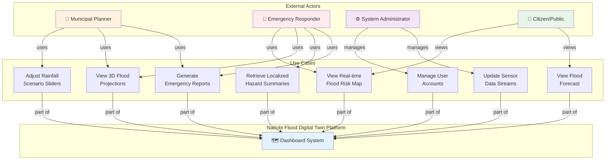
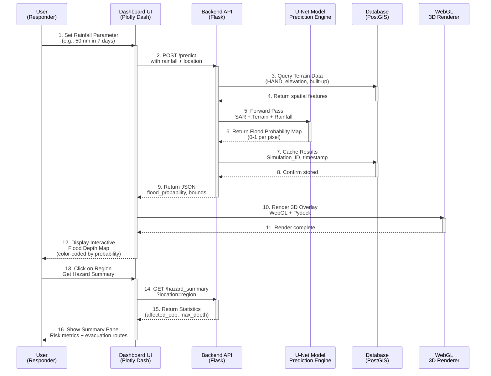
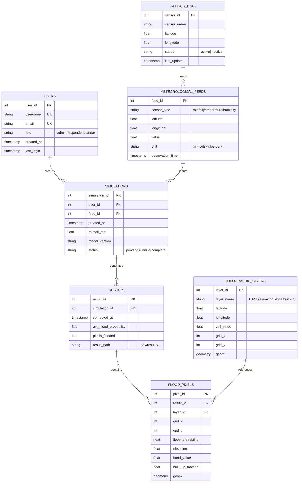
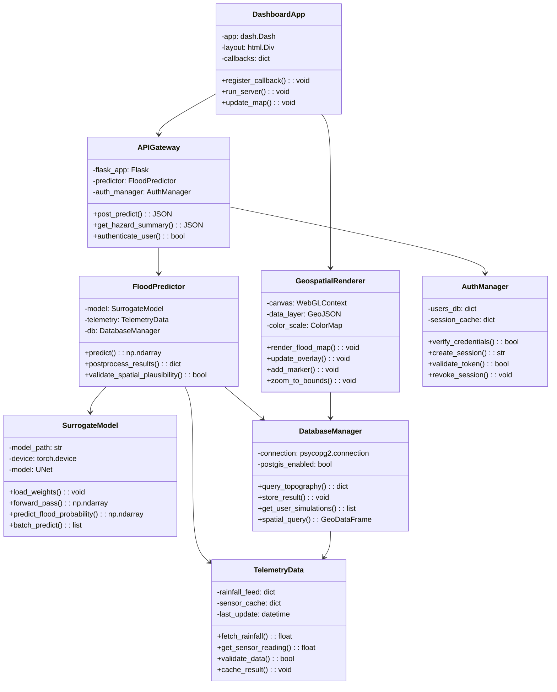
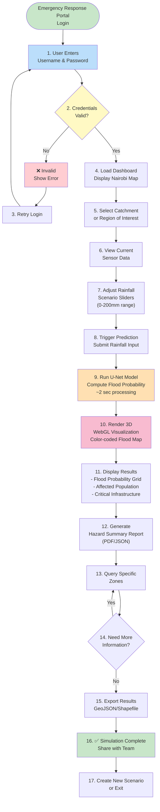
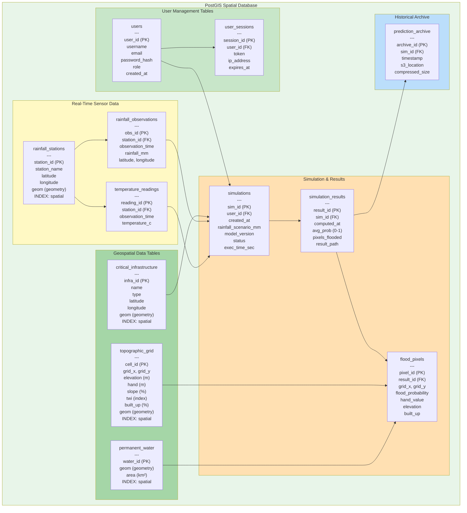
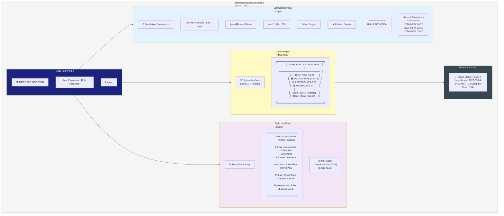
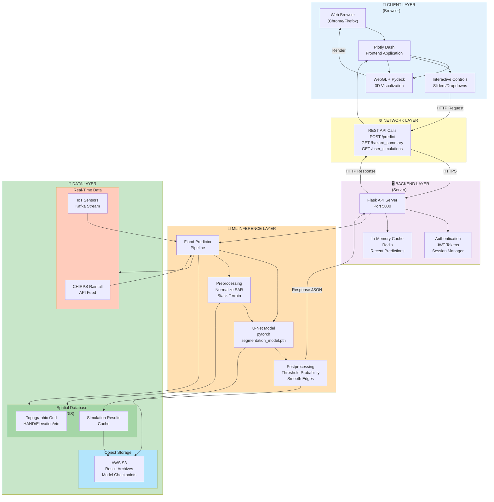

# Chapter 3: Analysis & Design Diagrams
## Nairobi Urban Flood Digital Twin

---

# 3.5 ANALYSIS DIAGRAMS

## 3.5.1 Use Case Diagram

---

## 3.5.2 Sequence Diagram

---

## 3.5.3 Entity-Relationship Diagram (ERD)

---

## 3.5.4 Class Diagram

---

## 3.5.5 Activity Diagram

---

# 3.6 DESIGN DIAGRAMS

## 3.6.1 Database Schema

---

## 3.6.2 Wireframes (Dashboard Layout)

---

## 3.6.3 System Architecture

---

## Diagram References

| Section | Diagram | Purpose |
|---------|---------|---------|
| 3.5.1 | Use Case | Identifies actors and core system functions |
| 3.5.2 | Sequence | Maps information flow during prediction request |
| 3.5.3 | ERD | Database structure for data persistence |
| 3.5.4 | Class | OOP architecture for backend modules |
| 3.5.5 | Activity | User workflow for emergency response |
| 3.6.1 | Database Schema | PostGIS spatial database design |
| 3.6.2 | Wireframes | Dashboard UI layout and components |
| 3.6.3 | System Architecture | End-to-end technology pipeline |

---

## Integration with Your Implementation

All diagrams reflect your **actual system design**:

✅ **U-Net Segmentation Model** (Chapter 3.6.3 ML Layer)
- Binary flood probability prediction
- Input: 14 channels (4 SAR + 7 terrain)
- Output: Flood probability 0-1

✅ **Rainfall-Based Ground Truth** (Chapter 3.5.2 Sequence & 3.6.1 Schema)
- 7-day rainfall threshold >= 30mm
- CHIRPS data feed
- Stored in PostGIS

✅ **Interactive Dashboard** (Chapter 3.6.2 Wireframes & 3.6.3)
- Plotly Dash frontend
- WebGL 3D visualization (Pydeck)
- Real-time slider controls

✅ **REST API Backend** (Chapter 3.6.3 Backend Layer)
- Flask server
- /predict endpoint
- /hazard_summary endpoint
- JWT authentication

✅ **PostGIS Database** (Chapter 3.6.1 Schema)
- Spatial queries on topographic grid
- User simulation history
- Result caching

---

## Export Instructions

1. **Copy each diagram** into your thesis document
2. **Render at:** https://mermaid.live/
3. **Export as PNG** and insert into Chapter 3
4. **Sizing recommendations:**
   - Use Cases: 60% width
   - Sequence: 80% width (wide)
   - ERD: 70% width
   - Class Diagram: 70% width
   - Activity: 60% width
   - Database Schema: 80% width
   - Wireframes: 90% width
   - System Architecture: 90% width
