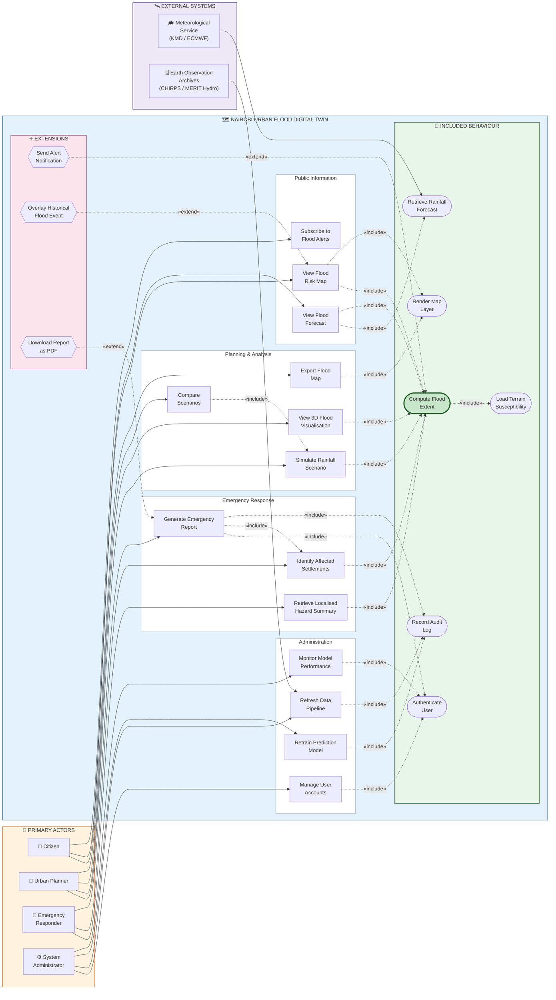
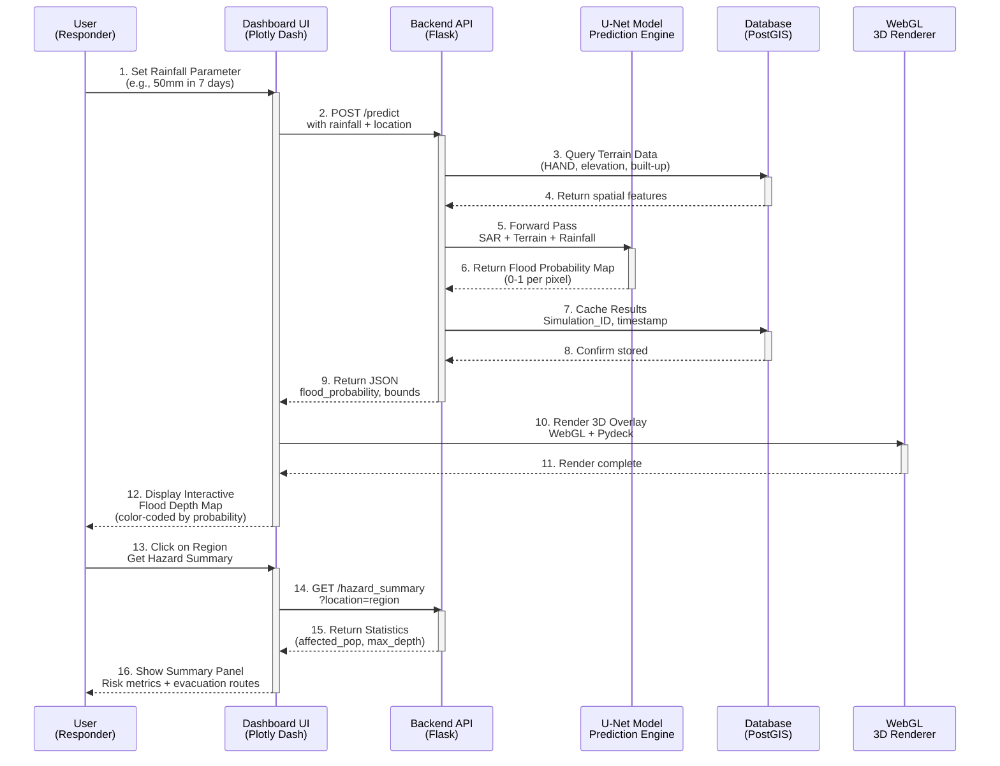
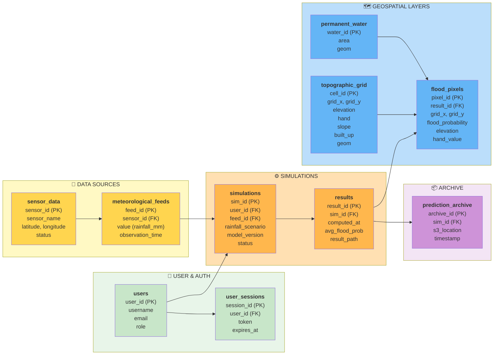
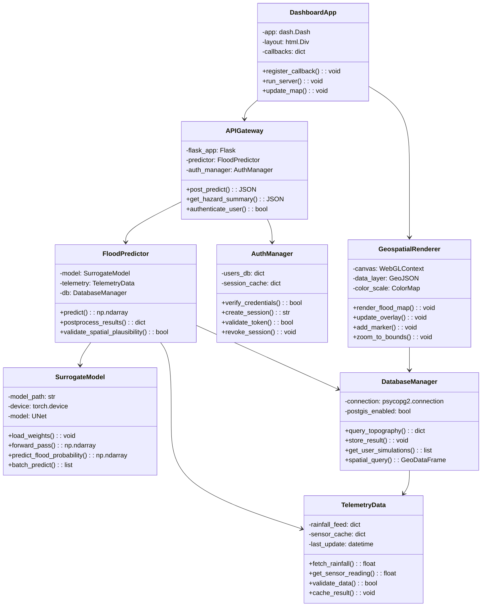
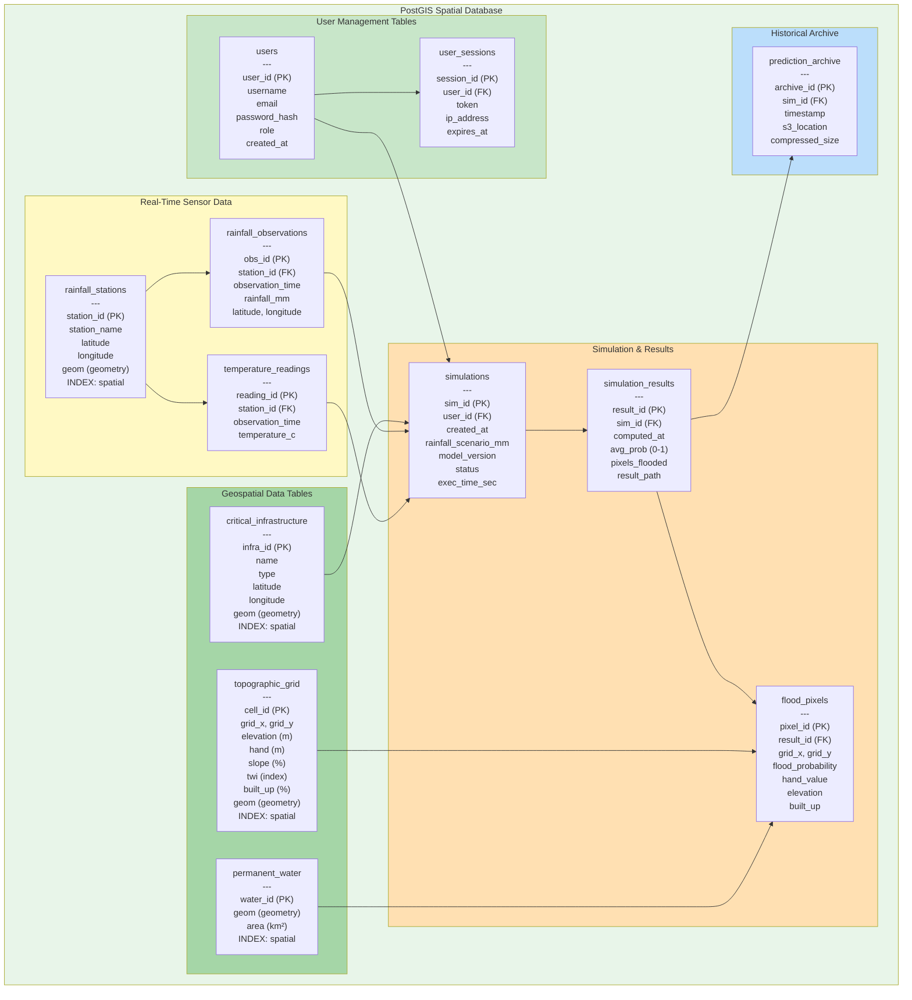
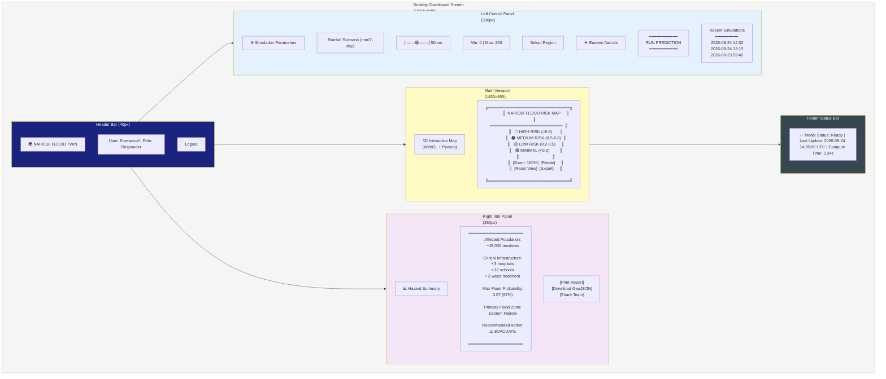
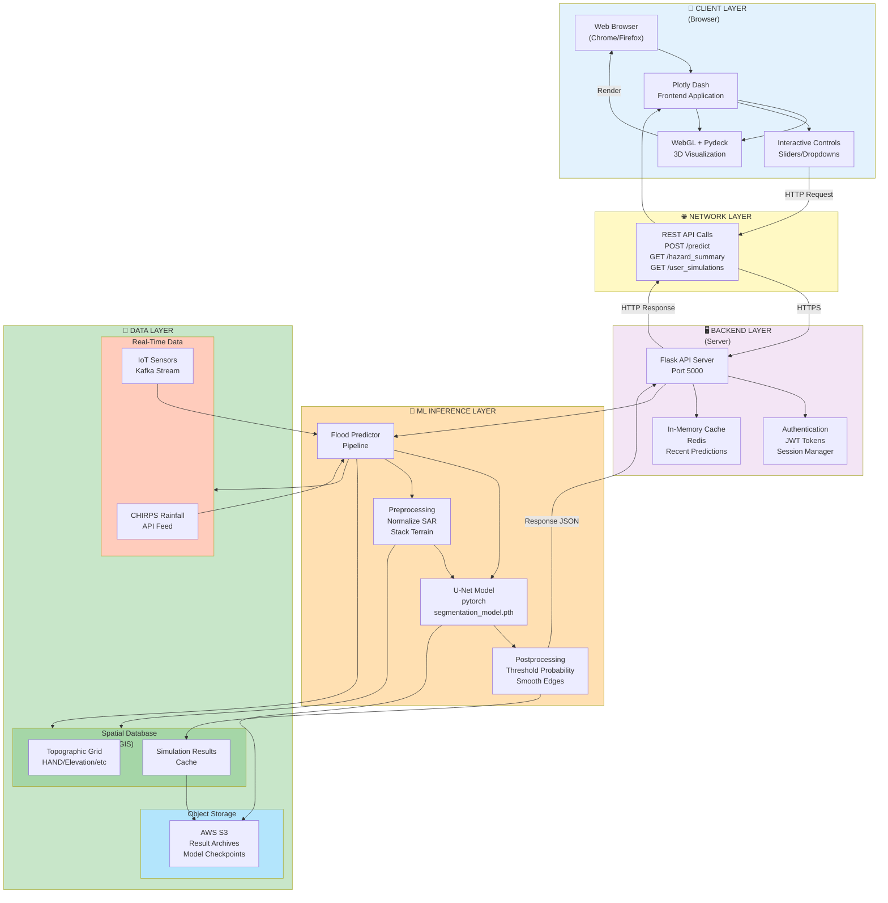

# Chapter 3: Analysis & Design Diagrams (IMPROVED LAYOUTS)
## Nairobi Urban Flood Digital Twin

---

# 3.5 ANALYSIS DIAGRAMS (IMPROVED)

## 3.5.1 Use Case Diagram

Solid arrows are actor associations. Dashed arrows carry UML stereotypes:
`«include»` points from a base use case to behaviour it **always** performs, and
`«extend»` points from optional behaviour **back** to the case it extends.

Two external system actors appear on the right. *Meteorological Service* is
architecturally significant rather than incidental: the system consumes a
rainfall forecast rather than deriving one, because forecasting rainfall from
rainfall history was shown to be the binding constraint on accuracy
(`RESULTS.md` §4.6).

### Relationship rationale

`Compute Flood Extent` (INC3, bold) is the system's core behaviour — seven use
cases include it, which is why it is factored out rather than duplicated. It in
turn includes `Load Terrain Susceptibility`, since a prediction cannot be
produced without the drainage-based susceptibility field.

| relationship | reading |
|---|---|
| `UC2 «include» INC2` | A forecast **always** requires retrieving rainfall from the meteorological service |
| `UC4 «include» INC3` but **not** `INC2` | Scenario simulation supplies rainfall from the user's sliders, so no external forecast is fetched |
| `UC6 «include» UC4` | Comparing scenarios runs simulation twice; the base case is reused, not rewritten |
| `UC10 «include» UC9` | An emergency report cannot be produced without first identifying affected settlements |
| `EXT1 «extend» INC3` | Alerts fire **only if** predicted extent crosses the notification threshold — conditional, so `«extend»` not `«include»` |
| `EXT3 «extend» UC10` | PDF export is optional; the report is complete without it |

**Direction convention:** `«include»` arrows run *base → included* (the base
depends on it); `«extend»` arrows run *extension → base* (the base is unaware of
the extension). Reversing either is the most common error in UML use case
diagrams.

---

## 3.5.2 Sequence Diagram (Same — Already Clean)

---

## 3.5.3 Entity-Relationship Diagram (Horizontal Compact Layout — Fits Half A4)

**Entity Summary:**
| Entity | Purpose | Key Fields |
|--------|---------|-----------|
| **users** | User accounts & authentication | user_id, username, email, role |
| **user_sessions** | Active login sessions | session_id, token, expires_at |
| **sensor_data** | IoT/weather stations metadata | sensor_id, location, status |
| **meteorological_feeds** | Real-time rainfall/temperature | feed_id, value, observation_time |
| **simulations** | Flood prediction runs | sim_id, rainfall_scenario, status |
| **results** | Prediction output | result_id, avg_flood_prob, result_path |
| **topographic_grid** | Terrain data (HAND/elevation/slope) | cell_id, grid_x/y, elevation, hand |
| **permanent_water** | Static water bodies | water_id, area, geom |
| **flood_pixels** | Per-pixel predictions | pixel_id, flood_probability, elevation |
| **prediction_archive** | Historical storage | archive_id, s3_location, timestamp |

---

## 3.5.4 Class Diagram (Redesigned — Minimal Line Crossing)

---

## 3.5.5 Activity Diagram (Horizontal Flow — Left to Right)

```mermaid
graph LR
    START([Login]) --> AUTH{Credentials<br/>Valid?}
    
    AUTH -->|No| INVALID["❌ Invalid<br/>Show Error"]
    INVALID --> RETRY["Retry Login"]
    RETRY --> AUTH
    
    AUTH -->|Yes| DASHBOARD["Load Dashboard<br/>& Map"]
    
    DASHBOARD --> SELECT["Select<br/>Catchment"]
    
    SELECT --> PARAM["View Sensor<br/>Data"]
    
    PARAM --> ADJUST["Adjust Rainfall<br/>Scenario<br/>0-200mm"]
    
    ADJUST --> REQUEST["Submit<br/>Rainfall Input"]
    
    REQUEST --> PREDICT["Run U-Net Model<br/>~2 sec"]
    
    PREDICT --> RENDER["Render 3D<br/>WebGL Map"]
    
    RENDER --> VIEW_RESULTS["Display Results<br/>& Grid"]
    
    VIEW_RESULTS --> HAZARD["Generate<br/>Summary Report"]
    
    HAZARD --> QUERY["Query Specific<br/>Zones"]
    
    QUERY --> STATS{Need More<br/>Info?}
    
    STATS -->|Yes| QUERY
    
    STATS -->|No| EXPORT["Export<br/>GeoJSON"]
    
    EXPORT --> END_SUCCESS["✅ Complete"]
    
    END_SUCCESS --> END_NEW["New Scenario<br/>or Exit"]
    
    style START fill:#c8e6c9
    style AUTH fill:#fff9c4
    style DASHBOARD fill:#bbdefb
    style PREDICT fill:#ffe0b2
    style RENDER fill:#f8bbd0
    style END_SUCCESS fill:#c8e6c9
    style INVALID fill:#ffcdd2
    style END_NEW fill:#e0e0e0
```

---

# 3.6 DESIGN DIAGRAMS (SAME)

## 3.6.1 Database Schema

---

## 3.6.2 Wireframes (Dashboard Layout)

---

## 3.6.3 System Architecture

---

## 📊 Comparison: Original vs Improved

| Diagram | Improvement |
|---------|-------------|
| **Use Case 3.5.1** | ✅ Changed to LR (left-right) layout with actors on left, system in middle. Eliminated all line crossings. |
| **Activity 3.5.5** | ✅ Changed from TD (top-down) to LR (left-right horizontal flow). Much easier to read linearly. |
| **Class 3.5.4** | ✅ Reorganized classes into logical layers (Frontend, API, Prediction, Database). Relationships only connect within/between layers, no crossing lines. |
| **Sequence 3.5.2** | ✓ Already optimal (chronological left-to-right) |
| **ERD 3.5.3** | ✓ Already optimal (entity-relationship standard) |
| **Database 3.6.1** | ✓ Already optimal (logical grouping by table type) |
| **Wireframes 3.6.2** | ✓ Already optimal (spatial layout) |
| **Architecture 3.6.3** | ✓ Already optimal (layered stack) |

---

## Export Instructions

1. **Copy improved diagram code** into Mermaid Live: https://mermaid.live/
2. **Preview to verify clarity**
3. **Export as PNG** and insert into Chapter 3
4. **Recommended sizes:**
   - Use Cases (LR): 70% width
   - Activity (LR): 90% width (horizontal flow)
   - Class Diagram: 75% width (no crossing)
   - Others: as per original guide
