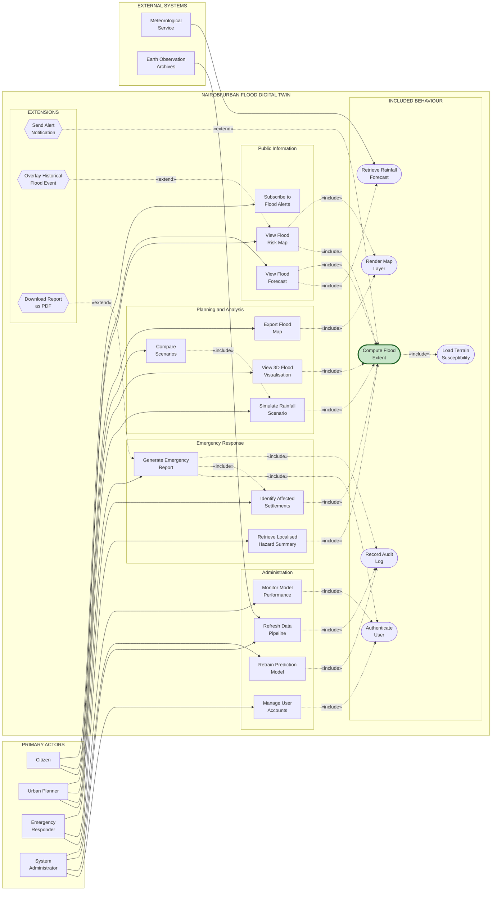
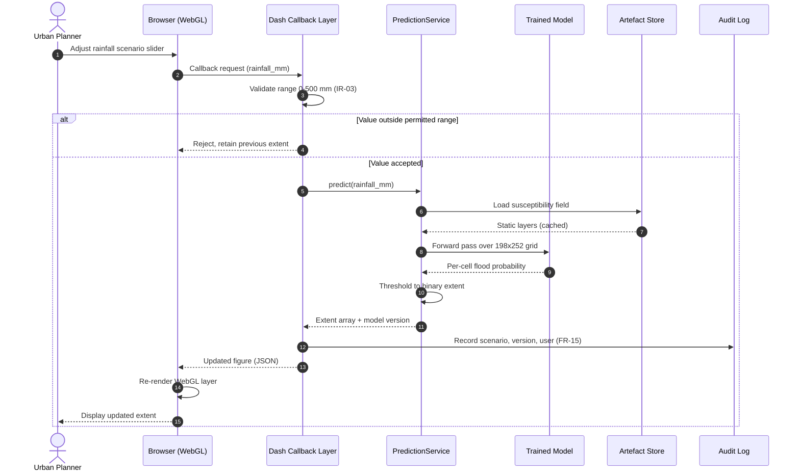
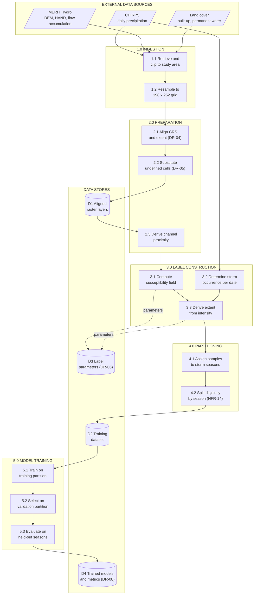
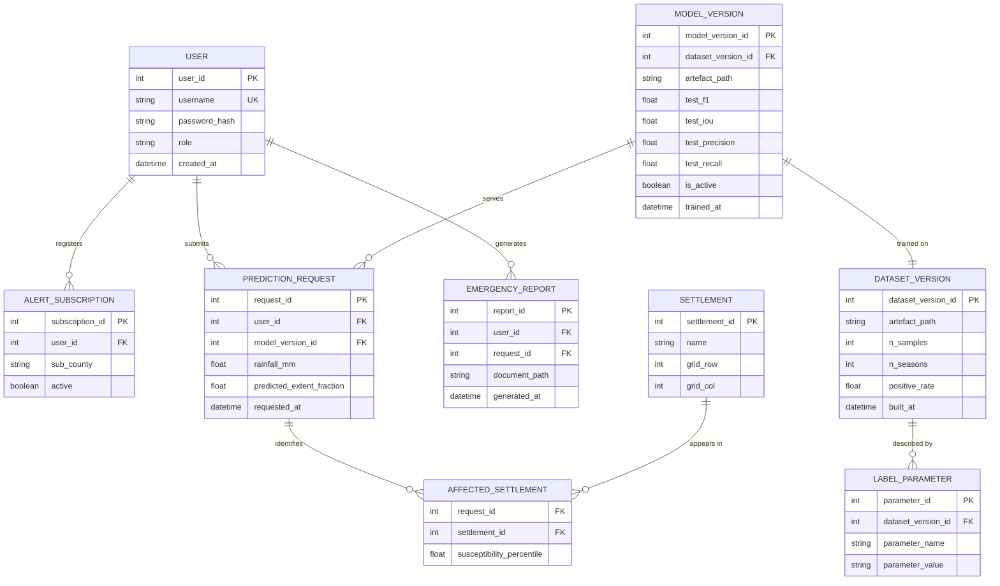
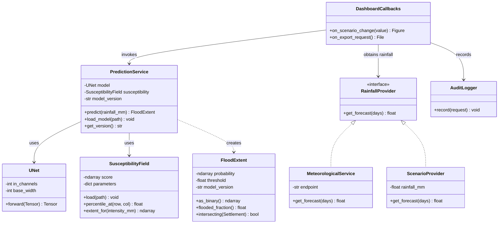
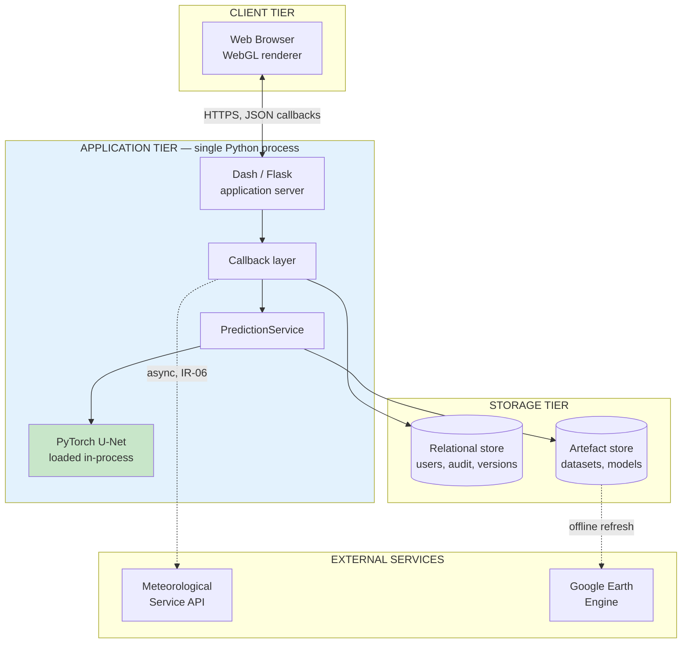

# Chapter 4: System Analysis and Design

## 4.1 Introduction

This chapter presents the analysis and design of the Nairobi Urban Flood Digital
Twin. It states the capabilities the system must provide, the measurable quality
conditions it must satisfy, the data and external services it depends upon, and
the diagrams used to communicate its structure and behaviour.

Section 4.2 presents the system requirements, organised as functional,
non-functional, data, and interface and integration requirements, each carrying a
unique identifier, a rationale and a verification method. Section 4.3 presents the
analysis diagrams: the use case diagram, the sequence diagram for the prediction
pathway, and the data-flow view of the geospatial pipeline. Section 4.4 presents
the design diagrams: the data and artefact architecture, the class model of the
prediction subsystem, and the deployment architecture.

Consistent with the paradigm justified in Chapter 3, the interactive dashboard is
modelled using Object-Oriented Analysis and Design (OOAD) and expressed in UML.
Because the predictive component is a machine-learning subsystem rather than a
transactional one, a strictly object-oriented view is insufficient on its own;
following the guidance that specialised projects may require a justified
combination of notations, the data pipeline is additionally modelled using
data-flow and pipeline views. This hybrid selection reflects the two distinct
concerns in the system — an interactive web application and a supervised learning
pipeline — rather than an attempt to apply every available notation.

A threshold used in a requirement below is stated only where it can be justified.
Where a numeric target appears, its source is identified: a measured baseline from
the experimental work reported in Chapter 5, an authoritative standard, or a
documented operating constraint. Requirements for which no defensible threshold
could be established are stated qualitatively with an inspection-based
verification method rather than given an invented number.

---

## 4.2 System Requirements

The system requirements identified for this project are presented in the
following subsections. Requirements are expressed following the guidance of
ISO/IEC/IEEE 29148:2018, and the quality characteristics in Section 4.2.2 are
selected from the product quality model of ISO/IEC 25010:2023.

Each requirement carries a unique identifier, a single testable statement, the
stakeholder or rationale from which it derives, and the method by which it will
be verified. Four verification methods are used: **Inspection** (examination of
the artefact), **Demonstration** (observation of operation), **Test** (execution
against defined inputs and expected results), and **Analysis** (measurement or
computation against recorded data).

### 4.2.1 Functional Requirements

Functional requirements describe the services the system provides under specified
conditions. They are grouped by the four actor roles established in the use case
model in Section 4.3.1.

**Public information services**

**FR-01:** The system shall display a flood risk map of Nairobi County to an
unauthenticated user, rendering predicted flood extent as a colour-coded overlay
on a base map.
*Rationale:* Objective (iv); public risk communication is the primary channel by
which residents receive warning. *Verification:* Demonstration.

**FR-02:** The system shall produce a flood extent prediction for a forecast
horizon of three days from a supplied rainfall forecast and the stored terrain
susceptibility field.
*Rationale:* Objective (iv); the three-day horizon matches the label definition
established in Chapter 3. *Verification:* Test.

**FR-03:** The system shall allow a user to register for flood alerts against a
selected sub-county and shall record the selection against that user's profile.
*Rationale:* Emergency responder and citizen need for targeted notification.
*Verification:* Test.

**Planning and analysis services**

**FR-04:** The system shall allow an urban planner to specify a rainfall scenario
by entering an accumulated rainfall depth in millimetres over the forecast window.
*Rationale:* Objective (iv); scenario exploration for adaptation planning.
*Verification:* Demonstration.

**FR-05:** The system shall regenerate and re-render the flood extent prediction
whenever a rainfall scenario parameter is changed, without requiring a page
reload.
*Rationale:* Gap identified in Section 2.4 concerning static, non-interactive
flood products. *Verification:* Demonstration.

**FR-06:** The system shall render predicted flood extent in three dimensions over
building footprints within the study area.
*Rationale:* Objective (iv); the spatio-temporal disconnect identified in
Section 2.4. *Verification:* Demonstration.

**FR-07:** The system shall allow a planner to hold one scenario result and
display a second scenario alongside it for comparison.
*Rationale:* Planner need for return-period comparison. *Verification:* Test.

**FR-08:** The system shall export the currently displayed flood extent as a
georeferenced raster or vector file.
*Rationale:* Interoperability with county GIS workflows. *Verification:* Test.

**Emergency response services**

**FR-09:** The system shall report, for a user-selected area, the predicted
flooded fraction of that area and the susceptibility ranking of its constituent
cells.
*Rationale:* Objective (iv); localised hazard summary for responders.
*Verification:* Test.

**FR-10:** The system shall identify and list the named settlements intersecting
the predicted flood extent for a given scenario.
*Rationale:* Responder need to prioritise deployment. *Verification:* Test.

**FR-11:** The system shall generate an emergency report containing the scenario
parameters, the predicted extent, the affected settlements and the generation
timestamp.
*Rationale:* Responder and planner need for a durable record.
*Verification:* Test.

**Administration services**

**FR-12:** The system shall authenticate a user and grant access only to the
functions permitted by that user's assigned role.
*Rationale:* NFR-04; separation of public, planning, response and administrative
functions. *Verification:* Test.

**FR-13:** The system shall allow an administrator to trigger a refresh of the
rainfall and terrain data pipeline and shall record the outcome of that refresh.
*Rationale:* Data currency; DR-07. *Verification:* Demonstration.

**FR-14:** The system shall allow an administrator to retrain the prediction model
against the current dataset and shall retain the previous model until the new one
is accepted.
*Rationale:* Model maintenance; prevents an unvalidated model replacing a working
one. *Verification:* Test.

**FR-15:** The system shall record, for each prediction request, the scenario
parameters, the model version used and the requesting user, in an append-only
audit log.
*Rationale:* NFR-08 accountability; reproducibility of any warning issued.
*Verification:* Inspection.

### 4.2.2 Non-Functional Requirements

The quality characteristics below are selected from ISO/IEC 25010:2023 on the
basis of their relevance to this project: performance efficiency, security,
reliability, usability, maintainability, and — because the system produces
predictions that may inform emergency decisions — the functional correctness and
transparency of the machine-learning component.

**Performance efficiency**

**NFR-01:** A flood extent prediction for the full 198 × 252 prediction grid shall
complete and render within 2 seconds of a scenario change, measured at the 95th
percentile over 50 consecutive requests on the reference hardware.
*Rationale:* The threshold derives from the operating constraint established in
Section 1.5 — the platform must run on standard office hardware in county
offices — and from the interaction requirement in FR-05, where a delay beyond
roughly two seconds breaks the sense of direct manipulation during scenario
exploration. *Verification:* Analysis (timed measurement).

**NFR-02:** The system shall operate on a workstation without a discrete graphics
processing unit, with model inference performed on CPU where no GPU is available.
*Rationale:* Section 1.5; the digital divide identified in Section 2.2.2 is
central to the project's justification. *Verification:* Demonstration on
GPU-absent hardware.

**NFR-03:** The stored prediction dataset shall not exceed 50 MB, so that it may
be distributed with the application rather than requiring separate provisioning.
*Rationale:* Deployment simplicity for under-resourced agencies; the current
dataset is 2 MB, so the threshold provides substantial margin without permitting
a return to the multi-gigabyte format that earlier iterations produced.
*Verification:* Inspection.

**Security**

**NFR-04:** Only a user holding the required role shall be able to invoke the
administration functions FR-13, FR-14 and the report generation function FR-11,
verified by attempting each function under every other role.
*Rationale:* Prevents unauthorised retraining or issuance of official reports.
*Verification:* Test (access-control matrix).

**NFR-05:** User credentials shall be stored as salted cryptographic hashes and
never in recoverable form.
*Rationale:* Confidentiality; standard practice. *Verification:* Inspection of
the stored representation.

**Reliability**

**NFR-06:** Where the external meteorological service is unavailable, the system
shall continue to serve scenario-based prediction (FR-04) and shall display the
age of the last successfully retrieved forecast.
*Rationale:* Limitation 1.7.1 — dependence on external API uptime was identified
as the principal operational risk; graceful degradation rather than total failure
is therefore required. *Verification:* Test with the external interface disabled.

**NFR-07:** The system shall retain the previously accepted model and dataset such
that a retraining operation (FR-14) can be reverted without data loss.
*Rationale:* An unvalidated model must not become unrecoverable.
*Verification:* Test.

**Usability**

**NFR-08:** Every quantitative value displayed on the map interface shall carry an
explicit unit or an explicit statement that the value is a dimensionless
probability.
*Rationale:* The system predicts flood *extent*, expressed as a probability per
cell, and not flood *depth*. Displaying an unlabelled numeric field invites
misinterpretation as a depth in metres, which the system does not estimate.
*Verification:* Inspection of every displayed field.

**NFR-09:** The interface shall state, wherever a prediction is displayed, that
flood extent is derived from a susceptibility model and has been validated at
neighbourhood rather than street scale.
*Rationale:* The validation reported in Chapter 5 supports neighbourhood-scale
claims only; presenting output without this qualification would overstate its
reliability. *Verification:* Inspection.

**Maintainability**

**NFR-10:** The model definition shall exist in exactly one location in the
codebase and shall be imported by every consumer, rather than duplicated between
the training environment and the application.
*Rationale:* Duplication between a training notebook and the repository was
identified during development as the mechanism by which defects persisted across
successive corrections. *Verification:* Inspection.

**NFR-11:** A rebuild of the training dataset from raw inputs shall be executable
by a single documented command and shall be deterministic under a fixed random
seed.
*Rationale:* Reproducibility of any reported result. *Verification:*
Demonstration and comparison of output checksums.

**Machine-learning quality**

**NFR-12:** The deployed prediction model shall achieve an F1 score on held-out
storm seasons exceeding **0.1592**, the score obtained by a logistic-regression
baseline on the identical split.
*Rationale:* This threshold is a measured baseline, not an assumed target. Two
reference points were computed on the same held-out data: a fixed terrain
stencil that ignores rainfall entirely (F1 = 0.1434) and a logistic regression on
antecedent rainfall (F1 = 0.1592). A model failing to exceed the stronger of these
provides no benefit over a substantially simpler method and would not justify
deployment. *Verification:* Analysis against the held-out test partition.

**NFR-13:** The model shall be evaluated using F1, Intersection over Union,
precision and recall, and shall not be evaluated using classification accuracy.
*Rationale:* The positive class constitutes approximately 0.9% of cells. A model
predicting no flooding anywhere attains 99.1% accuracy while providing no
information, making accuracy actively misleading for this problem.
*Verification:* Inspection of the evaluation procedure.

**NFR-14:** The training, validation and test partitions shall be disjoint at the
level of storm seasons, such that no storm season contributes samples to more
than one partition.
*Rationale:* Consecutive samples share overlapping rainfall windows and identical
terrain. A partition at sample level would place near-duplicate records in both
training and test data and inflate every reported metric.
*Verification:* Test asserting empty intersection between partition season sets.

**NFR-15:** The recall of the deployed model shall exceed its precision at the
operating threshold.
*Rationale:* In an early-warning application the cost of a missed flood exceeds
the cost of a false alarm. This asymmetry is implemented through the loss
function and must be verified in the resulting behaviour rather than assumed.
*Verification:* Analysis of the test-partition confusion matrix.

### 4.2.3 Data Requirements

**DR-01:** The system shall ingest daily precipitation estimates for the Nairobi
study area from the CHIRPS dataset, in millimetres per day.
*Verification:* Inspection of ingested records against source.

**DR-02:** The system shall ingest a digital elevation model and the terrain
derivatives slope, topographic wetness index, height above nearest drainage and
upstream flow accumulation, resampled to the 198 × 252 prediction grid.
*Verification:* Inspection of array shapes and value ranges.

**DR-03:** The system shall ingest a built-up surface fraction layer and a
permanent surface water layer for the same grid.
*Verification:* Inspection.

**DR-04:** All spatial layers shall be aligned to a single coordinate reference
system and grid extent, bounded by latitude −1.23° to −1.35° and longitude 36.72°
to 36.90°.
*Verification:* Test asserting identical shape and geotransform across layers.

**DR-05:** Cells for which an input layer is undefined shall be assigned a
documented default value rather than propagated as missing, and the substitution
shall be recorded.
*Rationale:* Undefined values propagating into the model produce undefined
predictions. *Verification:* Test with deliberately corrupted input.

**DR-06:** Training labels shall be derived from a documented, parameterised rule
whose parameters are recorded alongside the dataset, such that any stored dataset
can be traced to the rule that produced it.
*Rationale:* The labels are constructed rather than observed; their provenance is
therefore part of the result and must be recoverable.
*Verification:* Inspection of the stored parameter record.

**DR-07:** The dataset shall record, for each sample, its calendar date and the
storm season to which it belongs.
*Rationale:* Required to enforce NFR-14 and to trace any sample to source data.
*Verification:* Inspection.

**DR-08:** The system shall retain each trained model together with the metrics
obtained on the held-out partition and the dataset parameters under which it was
trained.
*Rationale:* A model without its evaluation context cannot be assessed or
compared. *Verification:* Inspection.

**DR-09:** The audit log required by FR-15 shall be append-only and shall be
retained for the operational life of the system.
*Verification:* Inspection.

**DR-10:** No personal data beyond a username, a hashed credential and an alert
subscription area shall be collected or stored.
*Rationale:* Data minimisation; the system's function does not require personal
information. *Verification:* Inspection of the stored schema.

### 4.2.4 Interface and Integration Requirements

**IR-01:** The system shall present a browser-based interface requiring no
client-side installation beyond a WebGL-capable browser.
*Rationale:* Section 1.5. *Verification:* Demonstration.

**IR-02:** The system shall obtain a quantitative rainfall forecast for the
forecast window from an external meteorological service.
*Rationale:* Established in Chapter 5, the accuracy ceiling of the system is set
by rainfall predictability rather than by the flood model. Consuming an external
forecast rather than deriving one internally is therefore a design decision, not
a convenience. *Verification:* Test against a recorded service response.

**IR-03:** Where the meteorological interface returns an error, times out, or
returns a value outside the range 0 to 500 mm, the system shall reject the
response, retain the previous forecast and record the failure.
*Rationale:* Guards against a malformed external response producing a spurious
warning. The upper bound exceeds the maximum three-day accumulation observed in
the eleven-year record and therefore rejects only implausible values.
*Verification:* Test with each fault injected.

**IR-04:** The system shall obtain terrain and historical precipitation layers
from Google Earth Engine through an authenticated service account.
*Verification:* Demonstration.

**IR-05:** The prediction subsystem shall expose a single documented entry point
accepting a rainfall scenario and returning a flood extent array, and the
dashboard shall interact with the model only through that entry point.
*Rationale:* NFR-10; prevents the interface and the training pipeline from
diverging in how the model is invoked. *Verification:* Inspection.

**IR-06:** External data retrieval shall occur asynchronously and shall not block
the rendering of the interface.
*Verification:* Demonstration under an artificially delayed response.

### 4.2.5 Requirements Traceability

Table 4.1 maps each requirement to the specific objective it serves, its priority
and its verification method.

**Table 4.1: Requirements Traceability Matrix**

| ID | Requirement (abbreviated) | Objective | Priority | Verification |
|---|---|---|---|---|
| FR-01 | Display flood risk map | iv | High | Demonstration |
| FR-02 | Produce three-day extent prediction | iv | High | Test |
| FR-03 | Register for flood alerts | iv | Medium | Test |
| FR-04 | Specify rainfall scenario | iv | High | Demonstration |
| FR-05 | Re-render on parameter change | iv | High | Demonstration |
| FR-06 | Render extent in three dimensions | iv | High | Demonstration |
| FR-07 | Compare two scenarios | iv | Medium | Test |
| FR-08 | Export flood extent | iv | Low | Test |
| FR-09 | Localised hazard summary | iv | High | Test |
| FR-10 | Identify affected settlements | iv | High | Test |
| FR-11 | Generate emergency report | iv | Medium | Test |
| FR-12 | Authenticate and authorise | iv | High | Test |
| FR-13 | Refresh data pipeline | iv | Medium | Demonstration |
| FR-14 | Retrain model with rollback | v | Medium | Test |
| FR-15 | Audit log of predictions | v | High | Inspection |
| NFR-01 | Prediction within 2 s at p95 | v | High | Analysis |
| NFR-02 | Operates without a GPU | v | High | Demonstration |
| NFR-03 | Dataset under 50 MB | v | Medium | Inspection |
| NFR-04 | Role-restricted functions | iv | High | Test |
| NFR-05 | Hashed credentials | iv | High | Inspection |
| NFR-06 | Degrade gracefully without forecast | v | High | Test |
| NFR-07 | Reversible retraining | v | Medium | Test |
| NFR-08 | Units stated on all displayed values | iv | High | Inspection |
| NFR-09 | Susceptibility basis disclosed | iv | High | Inspection |
| NFR-10 | Single model definition | v | High | Inspection |
| NFR-11 | Deterministic dataset rebuild | v | High | Demonstration |
| NFR-12 | F1 exceeds 0.1592 baseline | v | High | Analysis |
| NFR-13 | Imbalance-appropriate metrics | v | High | Inspection |
| NFR-14 | Season-disjoint partitions | v | High | Test |
| NFR-15 | Recall exceeds precision | v | Medium | Analysis |
| DR-01–DR-10 | Data provenance and retention | i, iv | High | Inspection / Test |
| IR-01–IR-06 | Interfaces and integration | iv | High | Demonstration / Test |

---

## 4.3 System Analysis Diagrams

### 4.3.1 Use Case Diagram

The use case diagram establishes the system boundary and identifies the external
actors that interact with the platform together with the services it exposes to
each. Four human actors were identified from the stakeholder analysis in
Chapter 1: a **Citizen**, who consumes public risk information; an **Urban
Planner**, who explores rainfall scenarios for adaptation planning; an
**Emergency Responder**, who requires localised hazard information and durable
reports; and a **System Administrator**, who maintains accounts, data and models.

Two external system actors also appear. The **Meteorological Service** supplies
the quantitative rainfall forecast required by IR-02. Its presence as an actor
rather than an internal component is a substantive design decision: the
experimental work reported in Chapter 5 established that predicting rainfall from
rainfall history is the factor limiting achievable accuracy, and the system
therefore consumes a forecast produced by an organisation equipped to generate
one. The **Earth Observation Archives** actor supplies the terrain and historical
precipitation layers required by DR-01 to DR-03.

Three UML relationships are used. Association connects an actor to a use case.
The `«include»` relationship denotes behaviour a base use case always performs and
is used to factor out services shared across several use cases. The `«extend»`
relationship denotes optional behaviour that occurs only under a stated condition.

**Figure 4.1: Use Case Diagram for the Nairobi Urban Flood Digital Twin**

The diagram's central structural feature is the convergence of seven use cases on
`Compute Flood Extent`. Viewing the risk map, viewing a forecast, simulating a
scenario, rendering the three-dimensional view, retrieving a hazard summary and
identifying affected settlements all depend on the same prediction service, which
is why it is factored out as included behaviour rather than restated within each
case. This concentration is realised in design as the single entry point required
by IR-05. `Compute Flood Extent` in turn includes `Load Terrain Susceptibility`,
since no prediction can be produced without the susceptibility field.

Two relationships distinguish cases that are otherwise easily conflated.
`View Flood Forecast` includes `Retrieve Rainfall Forecast`, because a forecast
necessarily requires current meteorological data. `Simulate Rainfall Scenario`
does not include it: the planner supplies the rainfall value directly, so no
external call occurs. This distinction is what allows the system to satisfy
NFR-06 and remain useful when the meteorological service is unavailable.

`Send Alert Notification` extends rather than includes `Compute Flood Extent`
because notification occurs only when predicted extent crosses a configured
threshold. Modelling it as an inclusion would incorrectly imply that every
prediction issues an alert.

### 4.3.2 Sequence Diagram: Scenario-Driven Prediction

The sequence diagram traces the interaction that occurs when an urban planner
adjusts a rainfall scenario, exercising FR-04, FR-05 and NFR-01. It shows the
ordering of messages between the browser, the callback layer, the prediction
subsystem and the persisted artefacts, and clarifies where the two-second budget
in NFR-01 is consumed.

**Figure 4.2: Sequence Diagram for Scenario-Driven Flood Prediction**

The diagram shows that the static susceptibility layers are loaded from the
artefact store rather than recomputed per request; because these layers are
identical for every sample, they are cached after first use, and the per-request
cost reduces to a single forward pass over the prediction grid. This is the design
decision by which NFR-01 is met on hardware without a GPU, as required by NFR-02.

The validation step precedes the call to the prediction subsystem. An
out-of-range rainfall value is rejected before any computation occurs and the
previously displayed extent is retained, satisfying IR-03 and preventing a
malformed input from producing a displayed result.

The audit record is written after the prediction returns but before the response
reaches the browser, ensuring that no extent can be displayed without a
corresponding log entry, as FR-15 requires.

### 4.3.3 Data-Flow View of the Geospatial Pipeline

The dashboard interaction modelled above consumes artefacts produced by an
offline pipeline. Because that pipeline transforms data through a series of
stages rather than exchanging messages between objects, it is represented as a
data-flow diagram rather than in UML, consistent with the hybrid approach stated
in Section 4.1. The diagram addresses DR-01 to DR-08.

**Figure 4.3: Data-Flow Diagram of the Geospatial and Training Pipeline**

The diagram makes explicit that label construction (process 3.0) is a
transformation applied to data rather than an observation of flooding. The
susceptibility field and the storm determination combine to produce the extent
label, and the parameters governing both are written to store D3 alongside the
dataset. This satisfies DR-06 and means any stored dataset can be traced to the
rule that produced it — a necessity given that the labels are derived rather than
measured.

Partitioning (process 4.0) occurs after label construction and operates on storm
seasons rather than individual samples. Because consecutive samples share
overlapping rainfall windows and identical terrain, a sample-level split would
place near-duplicate records across partitions; assigning whole seasons prevents
this, discharging NFR-14.

---

## 4.4 System Design Diagrams

### 4.4.1 Data and Artefact Architecture

Conventional relational schemas suit transactional records but not the dense
gridded arrays that dominate this system. The design therefore separates two
storage concerns: a relational store for the application's transactional data,
and a versioned artefact store for the arrays and models. This division follows
the guidance that a machine-learning project may require a data-pipeline or
feature-store design in place of a purely relational schema.

**Figure 4.4: Logical Database Schema**

The schema's defining feature is that `MODEL_VERSION` references
`DATASET_VERSION`, which is in turn described by `LABEL_PARAMETER`. A prediction
can therefore be traced from the displayed result, through the model that
produced it, to the dataset and the exact label parameters under which that model
was trained. This chain discharges DR-06 and DR-08 and makes any warning the
system issues reproducible after the fact — a requirement arising directly from
the labels being constructed rather than observed.

`MODEL_VERSION.is_active` permits exactly one model to serve predictions while
retaining its predecessors, satisfying the rollback requirement NFR-07. Storing
the four evaluation metrics on the version record rather than externally allows
NFR-12 to be checked before a model is activated.

`PREDICTION_REQUEST` provides the audit trail of FR-15. Gridded arrays are not
stored in the database; the `artefact_path` columns reference the file-based
artefact store, keeping the relational store small while preserving the
association between a record and the array it describes.

### 4.4.2 Class Diagram of the Prediction Subsystem

The class diagram details the object structure of the prediction subsystem and
the boundary through which the dashboard invokes it, addressing IR-05 and NFR-10.

**Figure 4.5: Class Diagram of the Prediction Subsystem**

`RainfallProvider` is defined as an interface with two realisations. This is the
design mechanism by which `View Flood Forecast` and `Simulate Rainfall Scenario`
share a single prediction pathway while differing in their rainfall source:
`MeteorologicalService` calls the external interface of IR-02, whereas
`ScenarioProvider` returns a value supplied by the planner. Because
`PredictionService` depends only on the interface, the system continues to
function when the external service is unavailable, discharging NFR-06.

`PredictionService` is the single entry point required by IR-05, and `UNet` is
referenced rather than redefined, satisfying NFR-10.

`FloodExtent` encapsulates the probability array together with the threshold and
the model version that produced it. Returning a typed object rather than a bare
array prevents a probability from being displayed as though it carried physical
units, which is the failure mode NFR-08 guards against.

### 4.4.3 Deployment Architecture

**Figure 4.6: Deployment Architecture**

The application tier is a single Python process in which the model is loaded
in-process rather than served behind a separate inference API. This is a
deliberate trade-off. It removes network latency from the prediction path, which
assists NFR-01, and it reduces the deployment to one process, which supports the
low-resource operating requirement of NFR-02. The cost is that the application
cannot scale horizontally without loading a model copy per worker. Given the
intended deployment — a county office serving a modest number of concurrent
users — the trade-off favours simplicity; a production deployment at county scale
would separate the model into its own service.

The dashed connection to the meteorological service denotes asynchronous
retrieval, as IR-06 requires, so that a slow external response does not block
rendering. The connection from the artefact store to Google Earth Engine is
likewise offline: terrain layers change rarely and are refreshed by the
administrative action FR-13 rather than on the request path.

---

## 4.5 Chapter Summary

This chapter established forty-six requirements — fifteen functional, fifteen
non-functional, ten data and six interface — each with an identifier, a stated
rationale and a verification method, and traced them to the research objectives
in Table 4.1. Numeric thresholds were stated only where they could be justified:
NFR-12 adopts a measured baseline of 0.1592 obtained from a logistic regression
on the same held-out data rather than an assumed target, NFR-13 excludes accuracy
on the basis of the measured 0.9% positive rate, and IR-03 bounds rainfall input
by the maximum accumulation observed in the eleven-year record.

The analysis diagrams established the system boundary and the concentration of
seven use cases on a single prediction service, traced the interaction and timing
of a scenario-driven prediction, and represented the offline pipeline through
which constructed labels are produced and partitioned. The design diagrams
specified a storage architecture that preserves the chain from a displayed
prediction to the label parameters that defined it, an object structure in which
the rainfall source is abstracted behind an interface so that scenario simulation
survives external service failure, and a single-process deployment whose
trade-offs were stated rather than assumed.

Two design decisions in this chapter follow directly from empirical findings
rather than from the initial proposal. The meteorological service appears as an
external actor because rainfall predictability, not flood modelling, was found to
limit achievable accuracy. NFR-08 and NFR-09 require explicit units and an
explicit statement of the susceptibility basis because the system predicts flood
extent and not flood depth, and because its spatial output has been validated at
neighbourhood rather than street scale. Chapter 5 reports the implementation and
the measurements from which these conclusions derive.
