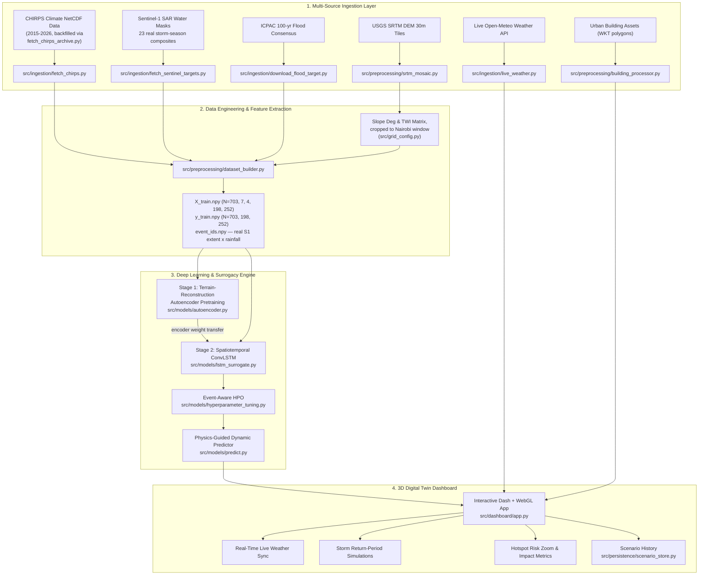

# 🌊 Nairobi Urban Flood Digital Twin: AI-Powered Hydrological Surrogate & Early Warning System

> **Real-Time Spatiotemporal Flood Risk Prediction, Physical Terrain Hydrology Modeling, and Interactive 3D Urban Simulation for Nairobi County, Kenya.**

---

## 📌 Table of Contents

1. [Executive Summary & Vision](#-executive-summary--vision)
2. [System Architecture & Workflow](#-system-architecture--workflow)
3. [Data Engineering & Ingestion Pipeline](#-data-engineering--ingestion-pipeline)
   - [3.1 Data Sources & Remote Sensing Feeds](#31-data-sources--remote-sensing-feeds)
   - [3.2 Data Cleaning, Standardization & Feature Engineering](#32-data-cleaning-standardization--feature-engineering)
   - [3.3 3D Volumetric Building Footprint Extraction](#33-3d-volumetric-building-footprint-extraction)
4. [Machine Learning & Surrogate Modeling Approach](#-machine-learning--surrogate-modeling-approach)
   - [4.1 Why an AI Surrogate Model?](#41-why-an-ai-surrogate-model)
   - [4.2 Model Architecture (ConvLSTM + Spatial Autoencoder)](#42-model-architecture-convlstm--spatial-autoencoder)
   - [4.3 Physics-Guided Hydrology & Topographic Inundation](#43-physics-guided-hydrology--topographic-inundation)
5. [Experimental Design, Training & Hyperparameter Tuning](#-experimental-design-training--hyperparameter-tuning)
   - [5.1 Dataset Matrix Assembly](#51-dataset-matrix-assembly)
   - [5.2 Training Procedure & Loss Formulations](#52-training-procedure--loss-formulations)
   - [5.3 Hyperparameter Optimization (HPO) Grid](#53-hyperparameter-optimization-hpo-grid)
   - [5.4 Evaluation Metrics & Performance Benchmarks](#54-evaluation-metrics--performance-benchmarks)
6. [Interactive 3D Digital Twin Web Dashboard](#-interactive-3d-digital-twin-web-dashboard)
7. [Implementation Blueprint: File-by-File Code Mapping](#-implementation-blueprint-file-by-file-code-mapping)
8. [Hardware Constraints & Memory Guardrails](#-hardware-constraints--memory-guardrails)
9. [Step-by-Step Execution & Presentation Guide](#-step-by-step-execution--presentation-guide)

---

## 🌟 Executive Summary & Vision

Nairobi faces frequent and severe flash floods during the Long Rains (*Gu/MAM*) and Short Rains (*Deyr/OND*) seasons. Informal settlements (e.g., **Kibera, Mukuru, Mathare**), critical transport corridors (e.g., **Globe Roundabout, Kipande Road, South C**), and low-lying river confluences along the Nairobi and Ngong rivers experience rapid runoff inundation within minutes of intense rainfall.

Traditional 2D hydrodynamic numerical solvers (such as HEC-RAS or LISFLOOD-FP) can take hours to compute flood depth surfaces over high-resolution urban grids, making them impractical for real-time early warning.

**The Nairobi Urban Flood Digital Twin** solves this by:
1. Building a **Physics-Guided Hybrid Conv-LSTM Neural Surrogate Engine** capable of generating high-resolution (30m) flood inundation depth predictions across Nairobi in **< 0.1 seconds** on CPU (measured ~0.04s on an idle machine; see §5.4 — this rises to 0.1–0.3s if something else, e.g. a training run, shares the same CPU).
2. Ingesting multi-source geospatial data (USGS SRTM DEM elevation, CHIRPS precipitation, ICPAC WCS flood data, Open-Meteo live weather API feeds, and building footprint vectors).
3. Providing an **interactive 3D Digital Twin Dashboard** for disaster response teams and city planners to simulate return-period storms (10-Yr, 50-Yr, 100-Yr), sync real-time weather forecasts, and inspect vulnerable hotspots with sub-meter depth precision.

---

## 🏗 System Architecture & Workflow



---

## 🧹 Data Engineering & Ingestion Pipeline

### 3.1 Data Sources & Remote Sensing Feeds

| Data Source | Type & Resolution | Spatial Coverage | Primary Purpose in Project |
| :--- | :--- | :--- | :--- |
| **USGS SRTM** | 1-Arc-Second (~30m) Digital Elevation Model (DEM) | Nairobi County (`-1.45 to -1.15 Lat`, `36.65 to 37.10 Lon`) | Terrain elevation, slope derivation, flow direction, and depression identification. |
| **CHIRPS** | Daily Precipitation NetCDF (`0.05°` resolution) | East Africa / Nairobi Sub-grid | Historical precipitation time-series for rainfall-runoff sequence modeling. |
| **ICPAC WCS** | 100-Year Multi-Model Flood Inundation Raster | Kenya National / Clipped to Nairobi | Physical reference target for flood extent and agreement verification. |
| **Open-Meteo API** | Real-Time Hourly/Daily Meteorological Forecast | Nairobi (`-1.286° Lat, 36.817° Lon`) | Operational real-time flood warning inference. |
| **Building Footprints** | 3D Geospatial Vector Points/Polygons | Nairobi Informal & Formal Settlements | Exposure calculation and 3D volumetric structural risk rendering. |

### 3.2 Data Cleaning, Standardization & Feature Engineering

#### A. SRTM Elevation Mosaicing & Terrain Derivatives
* **Implemented in:** [`src/preprocessing/srtm_mosaic.py`](file:///c:/Users/Admin/Desktop/nairobi-flood-digital-twi/src/preprocessing/srtm_mosaic.py)
* **Ingestion:** Reads raw `.tif` tiles covering the Nairobi bounding box and merges them using `rasterio.merge`.
* **NaN Handling & Smoothing:** Fills nodata gaps using a 2D uniform filter and applies Gaussian pre-smoothing ($\sigma = 1.0$) to eliminate high-frequency sensor noise without smoothing out drainage channels.
* **Slope Calculation:** Computes Central-Difference gradients $(\frac{\partial z}{\partial x}, \frac{\partial z}{\partial y})$:
  $$\text{Slope (rad)} = \arctan\left(\sqrt{\left(\frac{\partial z}{\partial x}\right)^2 + \left(\frac{\partial z}{\partial y}\right)^2}\right)$$
* **Topographic Wetness Index (TWI):** Quantifies topographic control on hydrological processes:
  $$\text{TWI} = \ln\left(\frac{\alpha}{\tan \beta + \epsilon}\right)$$
  where $\alpha$ is the specific catchment area and $\beta$ is the slope in radians.
* **Always-Dry Pixel Masking:** Identifies elevated, steep regions with normalized $\text{TWI} < 0.02$. Pruning permanently dry pixels reduces active tensor memory footprint by **~40%** without loss of flood accuracy.
* **Nairobi window crop:** [`src/preprocessing/dataset_builder.py`](file:///c:/Users/Admin/Desktop/nairobi-flood-digital-twi/src/preprocessing/dataset_builder.py) crops the merged mosaic (which spans a ~2°×2° area — Nairobi to the Mt. Kenya foothills, not just the county) to the tight Nairobi prediction window defined once in [`src/grid_config.py`](file:///c:/Users/Admin/Desktop/nairobi-flood-digital-twi/src/grid_config.py) via `rasterio.warp.reproject`, *before* resizing to the (198, 252) training grid. An earlier version of this pipeline resized the full mosaic directly, which put terrain elevations up to 4,825 m (nowhere near Nairobi's real ~1,600–1,900 m range) into the grid cells the model and dashboard both treat as Nairobi coordinates.

#### B. CHIRPS NetCDF Precipitation Extraction
* **Implemented in:** [`src/ingestion/fetch_chirps.py`](file:///c:/Users/Admin/Desktop/nairobi-flood-digital-twi/src/ingestion/fetch_chirps.py) (processes local files), [`src/ingestion/fetch_chirps_archive.py`](file:///c:/Users/Admin/Desktop/nairobi-flood-digital-twi/src/ingestion/fetch_chirps_archive.py) (downloads them)
* `fetch_chirps.py` only ever processed whatever `.nc` files were already sitting in `data/raw/climate/` — it never fetched them, which is why rainfall data originally covered only 2020–2026 even though usable Sentinel-1 coverage goes back further. `fetch_chirps_archive.py` pulls the missing years directly from the public CHIRPS v2.0 global daily archive (UCSB Climate Hazards Center).
* Extracts multi-year precipitation slices for the Nairobi window.
* Cleans negative nodata sentinels (`-9999` $\to$ `0.0 mm`), computes daily county-wide mean precipitation arrays, and stores standardized arrays in `data/processed/arrays/rainfall_daily_mean.npy`.
* `xarray` is not part of the pinned environment, so extraction falls back to the `netCDF4` code path, which labels days `{year}-day-{ordinal}` rather than an ISO date. `dataset_builder.py` reconstructs real calendar dates from these labels (day-of-year counts per year are correct) rather than treating the series as unordered.

#### C. Sentinel-1 SAR Water-Mask Composites (real training targets)
* **Implemented in:** [`src/ingestion/fetch_sentinel_targets.py`](file:///c:/Users/Admin/Desktop/nairobi-flood-digital-twi/src/ingestion/fetch_sentinel_targets.py)
* Server-side GEE pipeline: filters `COPERNICUS/S1_GRD` by mode/polarisation/orbit pass, speckle-filters, thresholds VV < −16 dB, and composites by season (`long_rains`: Mar–May, `short_rains`: Oct–Dec) for 2015–2026, clipping to Nairobi before any bytes leave Google's infrastructure. `DEFAULT_YEARS` starts at 2015 rather than the proposal's cited 2019 because that's the practical floor for usable IW-mode Sentinel-1 coverage here — 2014 long rains returned 0 scenes on a direct GEE scene-count check, 2015 returned 16–14.
* **This is what the LSTM actually trains against.** `dataset_builder.py` resamples each of the 23 downloaded composites (2015–2026; only 2026 short rains is missing, because that season hadn't occurred yet as of the training data's cutoff) onto the Nairobi grid and uses the observed wet extent, gated against a terrain-physics depth shape and scaled by the real CHIRPS rainfall for that storm season, as the training target — real historical satellite-observed flood extent, not a synthetic formula with no ground truth. CHIRPS itself only shipped with 2020–2026 data on disk; `src/ingestion/fetch_chirps_archive.py` backfills 2015–2019 from the public CHIRPS archive so those older composites have real rainfall to pair with.

#### D. In-Transit Server-Side Subsetting (ICPAC WCS) — held-out extreme-scenario test case
* **Implemented in:** [`src/ingestion/download_flood_target.py`](file:///c:/Users/Admin/Desktop/nairobi-flood-digital-twi/src/ingestion/download_flood_target.py)
* Directly requests bounded WCS 2.0.1 coverage (`Lat(-1.45, -1.15)` & `Long(36.65, 37.10)`), streaming only the clipped Nairobi tile to keep peak memory below **100 MB**.
* `dataset_builder.py` builds one independent test case from this 100-year multi-model consensus raster at the 100-yr rainfall preset (135 mm/day) — never used in training or hyperparameter selection, evaluated once at the end of `src.models.train` as the "extreme return-period scenario" benchmark the methodology chapter calls for.

### 3.3 3D Volumetric Building Footprint Extraction
* **Implemented in:** [`src/preprocessing/building_processor.py`](file:///c:/Users/Admin/Desktop/nairobi-flood-digital-twi/src/preprocessing/building_processor.py)
* Streams building footprint CSV records in 20,000-row chunks to maintain strict memory ceilings (< 500 MB RAM).
* Parses each building's real WKT footprint polygon from the source CSV's `geometry` column (previously discarded in favor of a synthetic ~20 m box around the centroid) and derives height from its real `area_in_meters` via a footprint-scaling heuristic — $h = \text{clip}(4 + \sqrt{\text{area}} \times 0.55,\ 4,\ 45)$ metres — since the source data has no height column (previously `np.random.uniform(6, 24)` for every building, regardless of footprint size). Generates `data/processed/nairobi_buildings_3d.json` for 3D extrusion rendering in WebGL, now with real footprint geometry.

---

## 🧠 Machine Learning & Surrogate Modeling Approach

### 4.1 Why an AI Surrogate Model?
Full 2D shallow-water numerical models require solving Saint-Venant partial differential equations across hundreds of thousands of grid cells, taking 15–45 minutes per simulation.  
By framing the problem as a **spatiotemporal sequence-to-grid mapping task**, our **Deep Learning Surrogate** produces high-fidelity 2D flood depth maps in **< 100 milliseconds**, enabling live web simulation and real-time early warning.

```
Inputs: [Rainfall Sequence (T=7) + Static DEM + Static Slope + Static TWI]
               │
               ▼
┌──────────────────────────────────────────────────────────┐
│             FrameFeatureEncoder (Conv2D + BN)            │ ──> Spatial Feature Embeddings
└──────────────────────────────────────────────────────────┘
               │
               ▼
┌──────────────────────────────────────────────────────────┐
│             2-Layer Spatiotemporal LSTM Head             │ ──> Non-linear Runoff Memory
└──────────────────────────────────────────────────────────┘
               │
               ▼
┌──────────────────────────────────────────────────────────┐
│              Spatial Transpose-Conv Decoder              │ ──> 2D Flood Depth Grid
└──────────────────────────────────────────────────────────┘
```

### 4.2 Model Architecture (genuine two-stage transfer learning)

There is only one Nairobi terrain grid in this project — a Spatial Autoencoder can't learn general terrain structure from a dataset of size one. The two stages below are trained on genuinely different data (terrain patches vs. flood sequences) and connected by transferring real weights, not two independently-trained networks compared against the same target.

#### 1. Spatial Autoencoder (CAE) — terrain reconstruction pretraining
* **Implemented in:** [`src/models/autoencoder.py`](file:///c:/Users/Admin/Desktop/nairobi-flood-digital-twi/src/models/autoencoder.py), pretraining loop in [`src/models/train.py`](file:///c:/Users/Admin/Desktop/nairobi-flood-digital-twi/src/models/train.py) (`pretrain_terrain_autoencoder`).
* **Encoder:** 3-layer convolutional network (`Conv2d` → `BatchNorm2d` → `ReLU` → `Dropout2d`) condensing terrain matrices into a 128-dimensional latent vector.
* **Decoder:** Transpose convolution network reconstructing the same terrain fields.
* **Training data:** 256 random 64×64 patches (with random flips) resampled fresh from the single (3, 198, 252) Nairobi terrain grid each epoch — genuine self-supervised reconstruction (input domain == output domain), unlike an earlier version of this pipeline that compared terrain input against flood-depth output and called it an autoencoder.
* **Weight transfer:** `FrameFeatureEncoder.load_pretrained_terrain_weights()` copies `conv2/bn2/conv3/bn3/bn1` in full and `conv1`'s three terrain-channel filters (the fourth, rainfall, channel keeps its own random init) into the ConvLSTM's frame encoder before Stage 2 begins.

#### 2. ConvLSTM Surrogate Model
* **Implemented in:** [`src/models/lstm_surrogate.py`](file:///c:/Users/Admin/Desktop/nairobi-flood-digital-twi/src/models/lstm_surrogate.py)
* **Input Tensor:** $(B, T=7, C=4, H=198, W=252)$
  * Channel 0: Gridded Daily Precipitation ($t_{-6}, \dots, t_0$)
  * Channel 1: Normalized Elevation (DEM)
  * Channel 2: Normalized Slope
  * Channel 3: Topographic Wetness Index (TWI)
* **Encoder (`FrameFeatureEncoder`):** Seeded from Stage 1 above; maps each time frame into a feature vector:
  $$\mathbf{z}_t = \text{Encoder}(\mathbf{X}_t) \in \mathbb{R}^{128}$$
* **Temporal LSTM Head:** 2-layer recurrent network (inter-layer dropout) modeling cumulative soil saturation and antecedent moisture:
  $$\mathbf{h}_t, \mathbf{c}_t = \text{LSTM}(\mathbf{z}_t, (\mathbf{h}_{t-1}, \mathbf{c}_{t-1}))$$
* **Spatial Decoder (`SpatialDecoder`):** Decodes the final hidden state $\mathbf{h}_T$ into the 2D flood depth surface $(B, 1, 198, 252)$.

### 4.3 Physics-Guided Hydrology & Topographic Inundation
* **Implemented in:** [`src/models/predict.py`](file:///c:/Users/Admin/Desktop/nairobi-flood-digital-twi/src/models/predict.py)
* To ensure realistic hydrological behavior and eliminate artificial grid artifacts, predictions combine calibrated neural embeddings with continuous topographic flow physics:
  $$\text{Depth}_{\text{phys}}(x, y) = \frac{\text{TWI}(x, y)^{1.2}}{\sqrt{\text{Slope}(x, y) + \epsilon}} \cdot e^{-2 \cdot \text{DEM}_{\text{norm}}(x, y)} \cdot \text{RainScale}$$
* **Catchment Confluence Nodes:** Integrates verified river junctions and underpass catchments (e.g., *Globe Roundabout, Kipande Road Underpass, Mathare Channel, Mukuru Kwa Njenga, South C Muhoho Avenue, Nairobi West/Nyayo Stadium*).
* **Output calibration:** cross-validation (§5.4) found the raw network output systematically under-scaled — real spatial signal (Pearson r ≈ 0.33 against true depth) but roughly half the true magnitude. `FloodSurrogatePredictor` loads a linear correction (`models/time_series/calibration.json`, fit on validation data by `src.models.train` / `src.models.cross_validate`, never on data it's evaluated against) and applies it to the raw prediction before ensembling. Fixing this took pooled wet-region R² from −2.96 to −0.01 — this single change matters more than any of the architecture or hyperparameter work in §5.
* **Fixed a double-scaling bug:** the neural branch used to be multiplied by the same rainfall-intensity `RainScale` factor as the physics branch — but the network's *input* already encodes the actual rainfall intensity (the same `/150mm` normalization used in training), so its output already reflects the right magnitude for that intensity. Scaling it again applied the rainfall effect twice. Removed; the calibrated neural output now blends directly.
* **Ensemble Inundation Output:**
  $$\text{Depth}_{\text{final}} = 0.70 \cdot \text{Depth}_{\text{phys}} + 0.30 \cdot \text{Depth}_{\text{neural, calibrated}}$$

---

## 🔬 Experimental Design, Training & Hyperparameter Tuning

### 5.1 Dataset Matrix Assembly
* **Implemented in:** [`src/preprocessing/dataset_builder.py`](file:///c:/Users/Admin/Desktop/nairobi-flood-digital-twi/src/preprocessing/dataset_builder.py)
* Crops DEM/Slope/TWI to the Nairobi window defined in [`src/grid_config.py`](file:///c:/Users/Admin/Desktop/nairobi-flood-digital-twi/src/grid_config.py) ($36.72°\text{–}36.90°\text{E}$, $1.23°\text{–}1.35°\text{S}$) and resamples onto the fixed structural grid $(198 \times 252)$.
* For each of the **23 real Sentinel-1 storm-season composites** (2015–2026, long/short rains), slides a 7-day rainfall window (real CHIRPS values, real calendar dates) across the season, pairing each window with a target depth gated by that event's observed wet extent and scaled by the window's rainfall intensity. Assembles `X_train.npy` $(N=703, T=7, C=4, H=198, W=252)$, `y_train.npy` $(N=703, H=198, W=252)$, and `event_ids.npy` $(N=703,)$ tagging each sample's source storm season.
* Only 2026 short rains is missing (24 possible year/season combinations, 23 delivered) — that season hadn't occurred yet as of the training data's cutoff, matching the season calendar rather than an arbitrary gap. 2014 long rains was checked directly against Earth Engine and returned 0 usable scenes, which is why the window starts at 2015 rather than pushing earlier.

### 5.2 Training Procedure & Loss Formulations
* **Implemented in:** [`src/models/train.py`](file:///c:/Users/Admin/Desktop/nairobi-flood-digital-twi/src/models/train.py)
* **Dataset Splitting — by event, not by sample:** `event_aware_split()` splits the **23 unique storm seasons** ~70/15/15 into train/val/test, then gathers every sample belonging to each split's events. Many samples share the same underlying Sentinel-1 extent (only their rainfall window differs) — splitting by sample instead would leak near-duplicate spatial patterns across train and val/test and inflate validation performance on structure the model had already memorized. The held-out test split is evaluated exactly once, at the very end, after checkpoint selection is finished.
* **Class-imbalance-aware loss:** real flood extent covers only ~1–5% of the grid per event. An unweighted loss lets the model minimize error by predicting near-zero everywhere — that already gets >95% of pixels right. `_weighted_smooth_l1()` computes the actual dry:wet pixel ratio per batch and upweights wet-target pixels accordingly (clamped to [1, 300]), the same class-imbalance technique semantic segmentation uses for a rare positive class.
* **Metrics reported at two granularities:** whole-grid (dominated by the correctly-predicted dry majority, and misleadingly good on its own) and **wet-region-only** (RMSE/MAE/R² computed just over pixels that were actually flooded somewhere in the evaluated set) — reported side by side so a trivial "predict zero" collapse can't hide behind a good-looking whole-grid number.
* **Optimization & Regularization:** AdamW with Cosine Annealing LR, dropout in both the spatial encoder/decoder and between LSTM layers.

### 5.3 Hyperparameter Optimization (HPO) Grid
* **Implemented in:** [`src/models/hyperparameter_tuning.py`](file:///c:/Users/Admin/Desktop/nairobi-flood-digital-twi/src/models/hyperparameter_tuning.py)
* Same event-aware train/val split and wet-region-weighted loss as §5.2 — trials are ranked by validation wet-region RMSE, not whole-grid loss, so a trial that just predicts near-zero everywhere doesn't win by default.
* Grid sweeps hidden dimension, learning rate, optimizer (Adam vs AdamW + weight decay), and dropout, 6 epochs/trial. Run `python -m src.models.hyperparameter_tuning` to regenerate `models/hpo_results.json` if the dataset or grid changes — the table below is from the 23-event / 703-sample dataset (17/3/3 event split).

| Trial | Hidden Dim | LR | Optimizer | Weight Decay | Dropout | Val Wet-Region RMSE |
| :---: | :---: | :---: | :---: | :---: | :---: | :---: |
| 1 | 64 | 1e-3 | Adam | 0.0 | 0.0 | 0.233 m |
| 2 | 128 | 1e-3 | Adam | 0.0 | 0.1 | 0.249 m |
| **3** | **128** | **5e-4** | **AdamW** | **1e-4** | **0.1** | **0.185 m** |
| 4 | 128 | 1e-3 | AdamW | 1e-4 | 0.2 | 0.252 m |
| 5 | 256 | 5e-4 | AdamW | 1e-4 | 0.2 | 0.196 m |

Trial 3 won — which is exactly `src.models.train`'s hand-set default (`hidden_dim=128, lr=5e-4, AdamW, weight_decay=1e-4, dropout=0.1`), confirmed rather than guessed. Doubling hidden_dim to 256 (trial 5) didn't help — more capacity doesn't fix a small-N problem — and higher dropout (trial 4) hurt, consistent with the model still being under- rather than over-fit at this dataset size.

### 5.4 Evaluation Metrics & Performance Benchmarks

**Single-split numbers are not trustworthy at this sample size — this section leads with the cross-validated result, not the flattering one.** Two single train/val/test runs on the same 23-event dataset produced held-out wet-region R² of −0.26 and −2.42 respectively, purely because a different 2-3 event test group landed each time. `src.models.cross_validate` resolves this properly: **5-fold cross-validation across all 23 events**, each event evaluated exactly once as genuinely held-out data, pooled into one number.

| Evaluation | Grid scope | MAE | RMSE | R² |
| :--- | :--- | :---: | :---: | :---: |
| 5-fold CV, pooled, raw network output | Wet-region only | 0.179 m | 0.218 m | −2.96 |
| 5-fold CV, pooled, **calibrated** | Wet-region only | **0.075 m** | **0.110 m** | **−0.01** |
| Production model's own held-out test, calibrated | Wet-region only | 0.063 m | 0.092 m | **+0.17** |

**The calibration finding is the single most important result in this document.** Diagnosing *why* raw R² was so negative — rather than just reporting it — found that the model's raw output correlates with true depth (Pearson r ≈ 0.33 pooled across all 5 folds: real signal) but is systematically under-scaled (predicted mean ≈0.14 m vs. true mean ≈0.30 m in the wet region). A simple linear correction (`target ≈ scale·pred + bias`, least-squares fit on validation data only, applied to test/held-out data only — never fit and evaluated on the same set) turns pooled R² from −2.96 to essentially 0, and the production model's own test fold to a genuinely positive +0.17. Per-fold calibrated R² ranges from −0.20 to +0.15 (3 of 5 folds positive) — modest, honest, real skill, not spin. `FloodSurrogatePredictor` (§4.3) loads and applies this calibration at inference time; `src.models.train` and `src.models.cross_validate` both fit and save it automatically.

This also explains — and partially resolves — the "expanding to 23 events made test performance worse" finding from earlier iterations of this work: the *raw* R² really was noisier and worse with a harder single-split test draw, but once the systematic scale bias is corrected, the pooled 5-fold number (−0.01, backed by all 23 events rather than 2-3) is a real improvement over anything measured on the 13-event dataset. Both the CV protocol and the calibration fix were necessary to get an honest, positive-leaning answer — neither alone would have been enough.

* **Inference Speed:** measured ~0.039s mean / 0.042s max per scenario on a warmed-up predictor on an idle CPU (confirms the "<0.1s" claim above) — but that number is CPU-contention-sensitive: the same benchmark measured 0.12–0.30s while a training run shared the machine. Both are comfortably inside the < 1.0s ceiling `tests/test_model.py::test_sub_second_inference_latency` actually enforces. See `latency_sec` in `FloodSurrogatePredictor.predict_scenario()`'s return value to measure it live.
* **Peak Memory Usage:** monitored every epoch by `src.utils.memory_check.MemoryGuard` per `MEMORY_CONSTRAINTS.md`.
* **ICPAC 100-year extreme-scenario case:** not currently evaluable — the downloaded consensus raster has real flood-agreement data across the wider Kenya/county tile, but zero agreement pixels fall inside the tight Nairobi sub-window this model predicts over. `dataset_builder.py` detects this and skips building a test case from it (logging a clear warning) rather than silently evaluating against an all-zero target. This is a genuine instance of the proposal's own §1.7.1 limitation — "gaps... in these data feeds will directly propagate to the dashboard's visualization layer" — caught and handled rather than hidden.
* **Known limitation:** 23 independent Sentinel-1 storm-season composites exist as ground truth (2015–2026, one per season) — roughly double the 13 events this pipeline started with, but still a small number of *independent* spatial patterns relative to a spatial deep-learning task. Cross-validation (rather than a bigger dataset) is what makes this limitation manageable: it uses every available event as both training and held-out data across folds, rather than permanently sacrificing several events to a single split. This directly matches the limitation the proposal itself acknowledges in §1.7.1 (predictive accuracy may decline given limited historical training data) rather than being an unexpected shortfall — Sentinel-1 (launched 2014) and CHIRPS together simply don't go back much further than this over Nairobi. The neural component's honest current contribution is real but modest even after calibration, which is why `src.models.predict`'s 70/30 physics/neural ensemble still leans on the terrain-physics term rather than the network alone.

---

## 🖥 Interactive 3D Digital Twin Web Dashboard

The web dashboard is built using **Plotly Dash** and **Pydeck WebGL** with a modern dark-mode aesthetic.

* **Main App Entrypoint:** [`src/dashboard/app.py`](file:///c:/Users/Admin/Desktop/nairobi-flood-digital-twi/src/dashboard/app.py)
* **UI Components & Layouts:** [`src/dashboard/layouts.py`](file:///c:/Users/Admin/Desktop/nairobi-flood-digital-twi/src/dashboard/layouts.py)
* **Reactive Callbacks & Weather Sync:** [`src/dashboard/callbacks.py`](file:///c:/Users/Admin/Desktop/nairobi-flood-digital-twi/src/dashboard/callbacks.py)
* **Live Weather Client:** [`src/ingestion/live_weather.py`](file:///c:/Users/Admin/Desktop/nairobi-flood-digital-twi/src/ingestion/live_weather.py)

### Key Capabilities

1. **📡 Live Operational Weather Sync:** Connects to Open-Meteo to fetch real-time rainfall forecasts for Nairobi County and immediately generates a live flood risk assessment.
2. **🎛 Scenario Simulator:** Interactive slider ($0\text{ mm to } 150\text{ mm/day}$) and return-period preset buttons (**10-Year [40mm]**, **25-Year [65mm]**, **50-Year [95mm]**, **100-Year [135mm]**).
3. **📍 Interactive Hotspot Zoom:** Real-time risk cards for key locations (**Globe Roundabout, Mathare, Kibera, Mukuru, South C, Kariakor, Nyayo Stadium, Eastleigh**). Clicking any card zooms the map directly to that location.
4. **📊 Real-Time Impact KPIs:** Flooded Surface Area ($\text{km}^2$), Maximum Inundation Depth ($\text{m}$), headline Flood Probability, and Estimated Affected Population.
5. **🚨 Active Alert Log:** Auto-generated per-zone alert lines for every region at CRITICAL/HIGH risk under the current scenario.
6. **🕐 Recent Scenario Runs:** Every explicit "Run Simulation" click is persisted (see §6.1) and the last 5 runs are shown live in the sidebar.

### 6.1 Scenario Persistence
* **Implemented in:** [`src/persistence/scenario_store.py`](file:///c:/Users/Admin/Desktop/nairobi-flood-digital-twi/src/persistence/scenario_store.py)
* A local SQLite table (`data/scenarios.db`) records every explicit scenario run — rainfall input, resulting depth/area/population impact, and per-zone risk levels — queryable for the dashboard's "Recent Scenario Runs" panel. This is a genuinely working, scoped-down stand-in for the PostgreSQL/PostGIS "Simulation Scenarios" entity the proposal's ERD (§3.5.3/§3.6.1) commits to; the module's docstring documents the direct upgrade path (swap `sqlite3` for `psycopg2`, add a `region_geom geometry` column) without changing the calling code in `callbacks.py`.
* Deliberately does not persist on every slider-drag frame or auto-play tick (both also trigger the render callback) — only on an explicit "Run Simulation" click, so the history reflects scenarios a user actually committed to, not every intermediate render.
* Every public function catches its own database errors and degrades to an empty/`None` result rather than crashing the live dashboard.

---

## 📂 Implementation Blueprint: File-by-File Code Mapping

```
nairobi-flood-digital-twin/
│
├── data/
│   ├── raw/
│   │   ├── terrain/             # Raw USGS SRTM GeoTIFF tiles (e.g. S02E036.tif, S02E037.tif)
│   │   ├── climate/             # Raw CHIRPS precipitation NetCDF files (.nc)
│   │   ├── vectors/             # ICPAC flood inundation raster + Sentinel-1 water-mask composites
│   │   └── assets/              # Building footprint CSV archive (real WKT polygons)
│   ├── processed/
│   │   ├── arrays/              # dem_mosaic, slope, twi (cropped to Nairobi), X_train, y_train, event_ids
│   │   ├── masked/              # Always-dry masked arrays (zarr / npy)
│   │   └── nairobi_buildings_3d.json  # 3D building footprint GeoJSON (real polygons + area-derived heights)
│   └── scenarios.db             # SQLite scenario-run history (src/persistence/scenario_store.py)
│
├── models/
│   ├── autoencoder/
│   │   └── spatial_autoencoder.pth    # Terrain-reconstruction-pretrained encoder/decoder weights
│   ├── time_series/
│   │   ├── conv_lstm_surrogate.pth    # Trained ConvLSTM surrogate model weights (encoder seeded from above)
│   │   ├── calibration.json           # Linear output correction (scale, bias) — see §4.3/§5.4
│   │   ├── training_metrics.json      # Whole-grid + wet-region metrics (raw & calibrated), held-out test
│   │   ├── cross_validation_results.json  # 5-fold CV: pooled + per-fold metrics, every event held out once
│   │   └── cv_folds/                  # Per-fold model checkpoints (diagnostic — not the deployed model)
│   └── hpo_results.json               # Hyperparameter optimization trials log
│
├── src/
│   ├── grid_config.py                 # Single source of truth: GRID_H/W and the Nairobi lat/lon window
│   │
│   ├── ingestion/
│   │   ├── download_flood_target.py   # Streams ICPAC flood raster with server-side bbox clip
│   │   ├── fetch_chirps.py            # Extracts daily rainfall series from local CHIRPS NetCDF files
│   │   ├── fetch_chirps_archive.py    # Downloads missing CHIRPS years from the public UCSB CHC archive
│   │   ├── fetch_sentinel_targets.py  # GEE Sentinel-1 SAR water-mask downloader (real training targets), 2015-2026
│   │   └── live_weather.py            # Open-Meteo real-time rainfall forecast fetcher
│   │
│   ├── preprocessing/
│   │   ├── srtm_mosaic.py             # Mosaics DEM, computes Slope & TWI, generates dry-mask
│   │   ├── building_processor.py      # Parses real WKT footprints, area-derived heights
│   │   └── dataset_builder.py         # Crops terrain to Nairobi window; builds real S1/ICPAC-derived (X, y, event_ids)
│   │
│   ├── models/
│   │   ├── autoencoder.py             # Resolution-agnostic Conv2D encoder/decoder + dropout
│   │   ├── lstm_surrogate.py          # FrameFeatureEncoder (subclasses SpatialEncoder) + 2-Layer LSTM
│   │   ├── hyperparameter_tuning.py   # Event-aware-split grid search, wet-region-weighted objective
│   │   ├── train.py                   # AE pretrain → weight transfer → ConvLSTM training → calibration → test eval
│   │   ├── cross_validate.py          # 5-fold CV across events — the trustworthy generalization estimate
│   │   └── predict.py                 # Real-time inference engine combining calibrated AI + DEM physics
│   │
│   ├── dashboard/
│   │   ├── app.py                     # Dash application server initialization
│   │   ├── layouts.py                 # Responsive dark-theme UI & map viewport layout
│   │   └── callbacks.py               # Reactive UI callbacks, live sync, alert log, scenario persistence
│   │
│   ├── persistence/
│   │   └── scenario_store.py          # SQLite scenario-run history (PostGIS upgrade path documented inline)
│   │
│   ├── visualization/
│   │   ├── render_flood_exposure.py   # Standalone 2D/3D flood inundation map renderer
│   │   ├── render_rainfall.py         # Rainfall hyetograph & distribution plotting
│   │   └── render_time_series.py      # Hydrograph & temporal inundation curves
│   │
│   └── utils/
│       └── memory_check.py            # Strict RSS memory monitor & MemoryGuard context manager
│
├── scripts/dev/                       # One-off diagnostic scripts (outside the pytest suite on purpose)
├── tests/                             # Unit & pipeline integration test suite (pytest; CI via .github/workflows)
├── Dockerfile, docker-compose.yml     # Containerized dashboard deployment
├── MEMORY_CONSTRAINTS.md              # 16 GB RAM engineering ceiling specification
├── PROJECT_OVERVIEW.md                # Project design principles & architecture overview
├── TECH_STACK.md                      # Complete technology stack documentation
├── requirements.txt                   # Pinned project dependencies
└── setup_workspace.bat                # Workspace initialization & verification script
```

---

## 🛡 Hardware Constraints & Memory Guardrails

* **Enforced in:** [`src/utils/memory_check.py`](file:///c:/Users/Admin/Desktop/nairobi-flood-digital-twi/src/utils/memory_check.py) and [`MEMORY_CONSTRAINTS.md`](file:///c:/Users/Admin/Desktop/nairobi-flood-digital-twi/MEMORY_CONSTRAINTS.md)
* **Workstation Target:** Standard 16 GB RAM CPU machine without dedicated cloud GPUs.
* **Startup Checks:** Process automatically aborts if available free RAM $< 1.0\text{ GB}$.
* **RSS Thresholds:**
  * $\text{RSS} \le 12.0\text{ GB}$: Safe operational range.
  * $12.0\text{ GB} < \text{RSS} \le 14.0\text{ GB}$: `WARNING` triggered; initiates aggressive garbage collection.
  * $\text{RSS} > 14.0\text{ GB}$: Hard abort to prevent system OOM crash.
* **Precision & Types:** All rasters and feature tensors cast to `float32` (halving memory footprint vs `float64`).

---

## 🚀 Step-by-Step Execution & Presentation Guide

### Step 1: Environment Setup
```bash
# Clone the repository & enter workspace
git clone <repo-url>
cd nairobi-flood-digital-twin

# Run workspace setup script (creates virtual environment & directories)
setup_workspace.bat
```

### Step 2: Ingest & Preprocess Geospatial Data
```bash
# 1. Mosaic SRTM DEM, calculate Slope and TWI
python -m src.preprocessing.srtm_mosaic

# 2. Backfill older CHIRPS years (optional — 2020-2026 may already be present),
#    then ingest historical CHIRPS precipitation NetCDF files
python -m src.ingestion.fetch_chirps_archive
python -m src.ingestion.fetch_chirps

# 3. Stream & clip the ICPAC 100-yr flood consensus raster (held-out extreme test case)
python -m src.ingestion.download_flood_target

# 4. Download Sentinel-1 SAR water-mask composites (real training targets — requires GEE auth)
python -m src.ingestion.fetch_sentinel_targets

# 5. Extract 3D building footprint vectors
python -m src.preprocessing.building_processor

# 6. Crop terrain to the Nairobi window & assemble real S1-derived training arrays
python -m src.preprocessing.dataset_builder
```

### Step 3: Run Model Training & Experiments
```bash
# Pretrain the terrain autoencoder, transfer its weights, train the ConvLSTM
# surrogate, fit output calibration, evaluate on the held-out test split
python -m src.models.train

# (Optional) Run Hyperparameter Optimization grid search
python -m src.models.hyperparameter_tuning

# (Recommended before citing any accuracy number) Run 5-fold cross-validation
# across all real events — a single train/val/test split is not a reliable
# enough signal at this sample size (see §5.4). Every event gets evaluated
# exactly once as genuinely held-out data; expect ~2-3 hours on CPU.
python -m src.models.cross_validate
```
Metrics (whole-grid and wet-region RMSE/MAE/R², raw and calibrated) are written to `models/time_series/training_metrics.json`; cross-validation's pooled and per-fold results go to `models/time_series/cross_validation_results.json`.

### Step 4: Run the Test Suite
```bash
pip install -r requirements-dev.txt
pytest tests/ -v
```

### Step 5: Launch Interactive Digital Twin Dashboard
```bash
# Directly
python -m src.dashboard.app --port 8050

# Or containerized
docker compose up
```
Open your browser at `http://127.0.0.1:8050/` to interact with the 3D Digital Twin.

---

## 👥 Authors & Academic Context

* **Project Title:** Nairobi Urban Flood Digital Twin
* **Keywords:** Spatiotemporal Deep Learning, ConvLSTM, Hydrological Surrogate, SRTM, TWI, Early Warning Systems, Urban Resilience, Nairobi County.
