# Thesis Diagrams — Nairobi Urban Flood Digital Twin

This document contains all Mermaid diagrams for your thesis. Copy each diagram into your thesis document or render them on the Mermaid Live Editor: https://mermaid.live/

---

## 1. System Architecture Overview

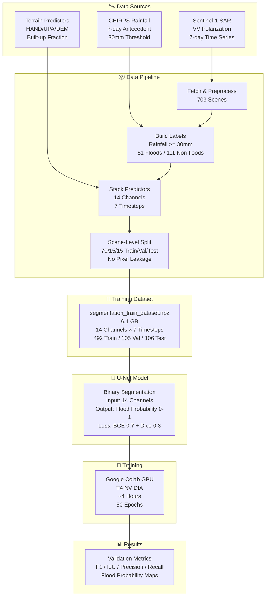

---

## 2. Problem Discovery Flow

```mermaid
graph LR
    A["Original Approach<br/>SAR -16dB Threshold"] 
    B["Finding 1<br/>R² ≈ 0<br/>Labels Inverted"]
    C["Investigation<br/>Spearman r = -0.74<br/>Anti-Correlated w/ Rainfall"]
    
    D["Attempt 1: Optical<br/>Sentinel-2 Water Index"]
    E["Finding 2<br/>156 Scenes<br/>0 Water Pixels"]
    F["Root Cause<br/>Urban Flooding<br/>10m Below Resolution"]
    
    G["Attempt 2: SAR CD<br/>Backscatter Drop vs Baseline"]
    H["Finding 3<br/>Mean Drop = -0.30 dB<br/>r = -0.399 Inverted"]
    I["Root Cause<br/>Wet Soil Increases<br/>VV Backscatter"]
    
    J["Solution<br/>Rainfall-Based Labels<br/>Use SAR + Terrain as Predictors"]
    K["Result<br/>31.5% Class Balance<br/>51 Floods / 111 Non-floods<br/>Ready to Train"]
    
    A --> B --> C
    C -->|Reject SAR Absolute| D --> E --> F
    F -->|Reject Optical| G --> H --> I
    I -->|Reject SAR CD| J --> K
    
    style A fill:#e1f5ff
    style J fill:#c8e6c9
    style K fill:#c8e6c9
```

---

## 3. Data Pipeline Architecture

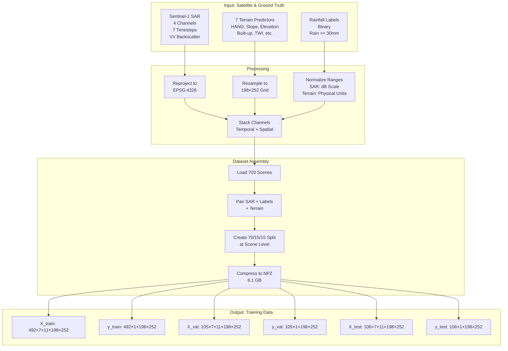

---

## 4. U-Net Model Architecture

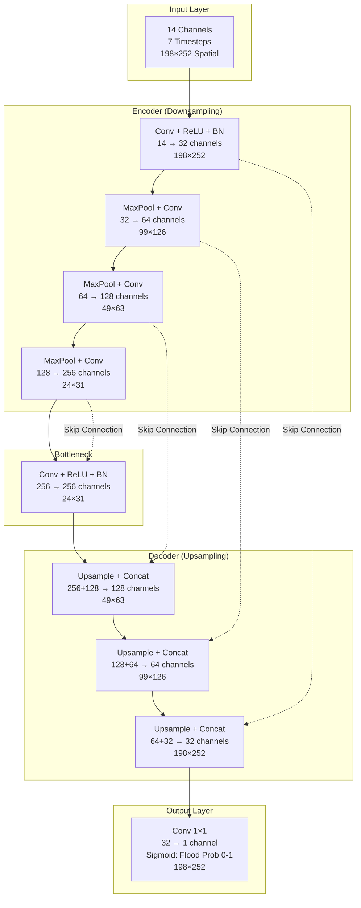

---

## 5. Training Loop Workflow

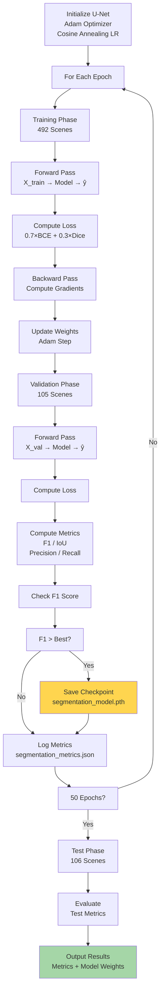

---

## 6. Loss Function Composition

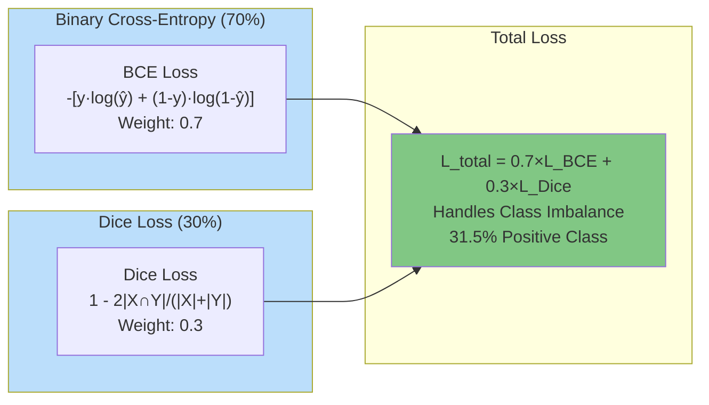

---

## 7. Class Distribution & Label Balance

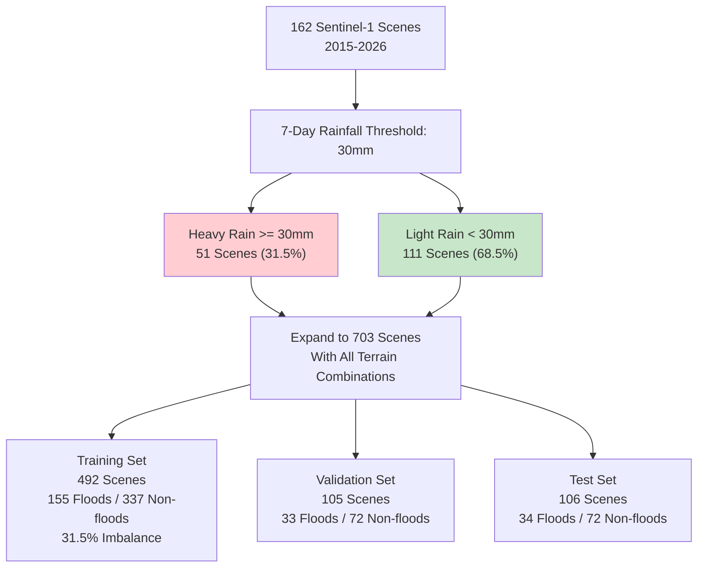

---

## 8. Validation Workflow

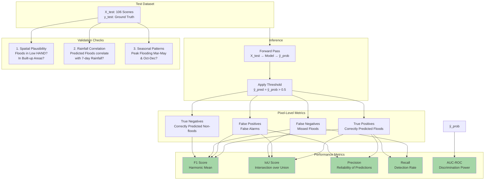

---

## 9. Colab Training Deployment

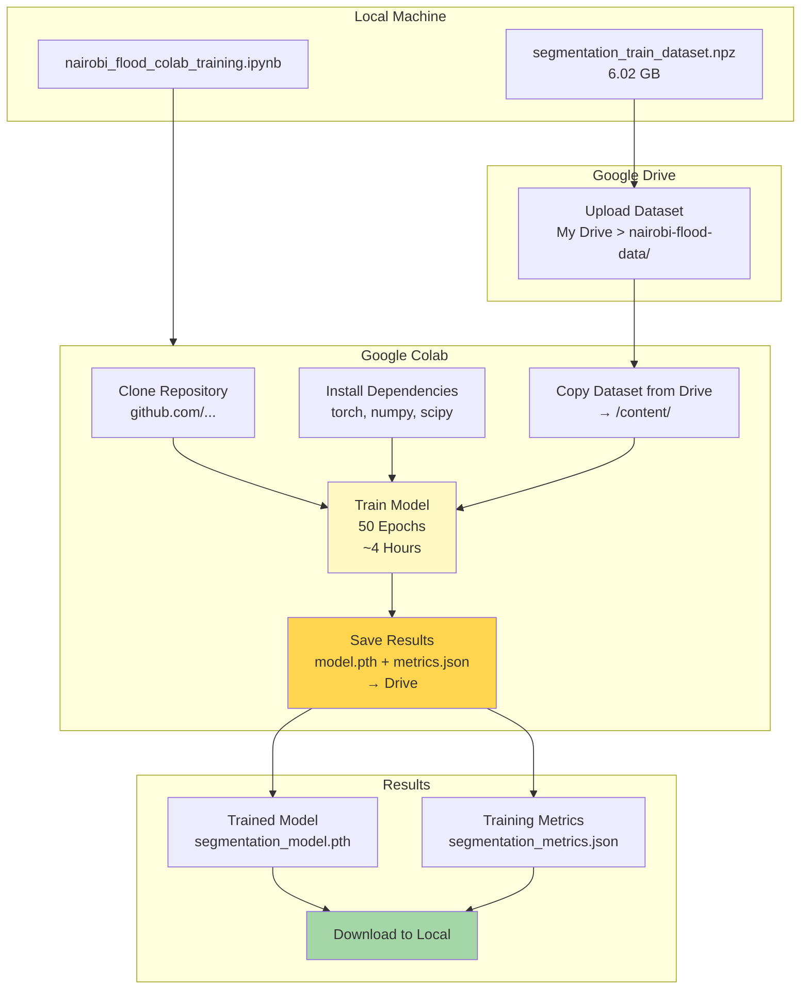

---

## 10. End-to-End System Flow

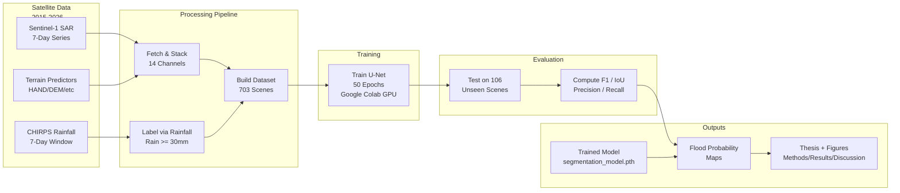

---

## 11. Rainfall Label Distribution

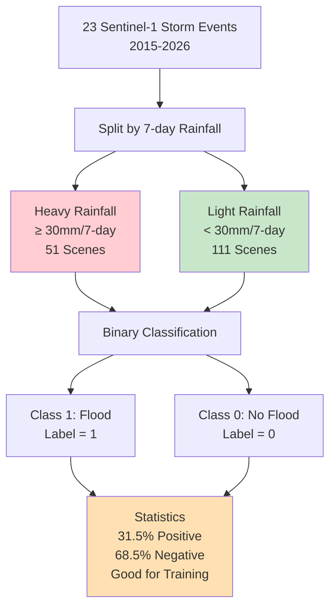

---

## 12. Model Performance Timeline (Expected)

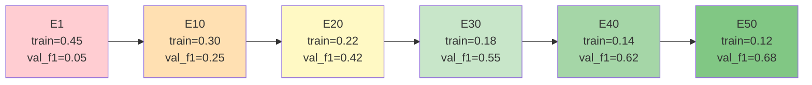

---

## 13. Input Channel Composition

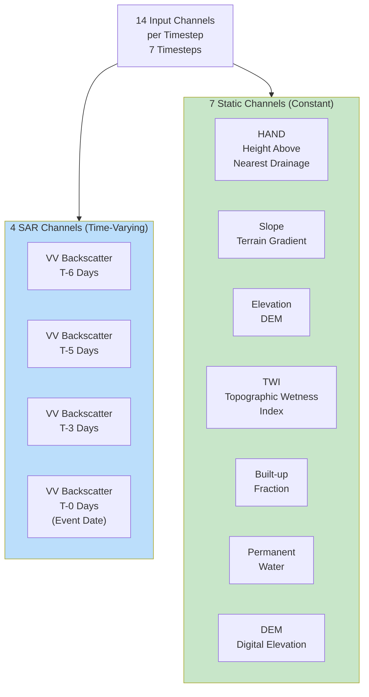

---

## 14. Decision Tree: Why Rainfall-Based Labels

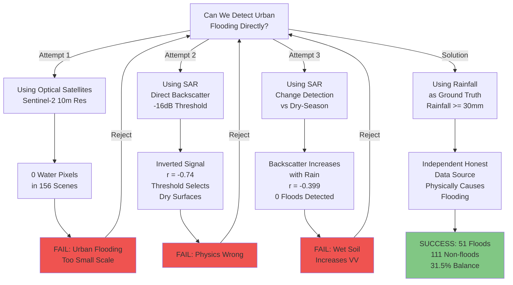

---

## 15. File Output Structure

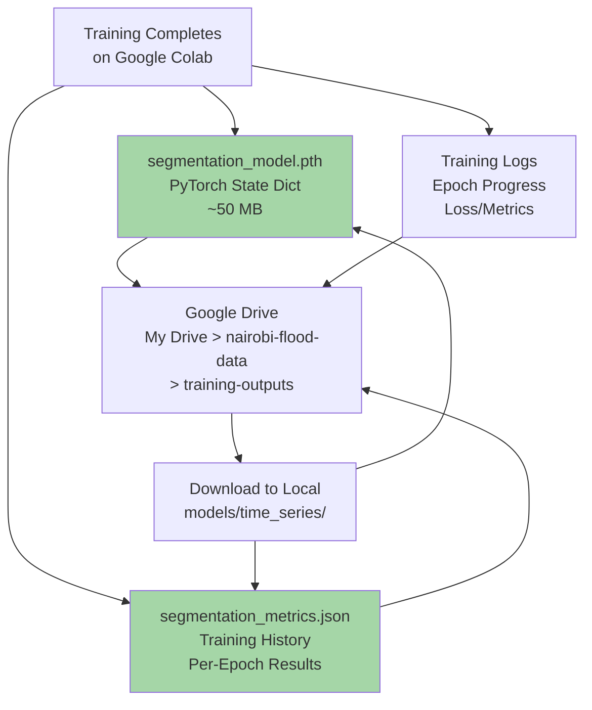

---

## Usage Instructions

1. **Copy each diagram** into your thesis document (Google Docs, Overleaf, Word)
2. **Use Mermaid Live Editor:** Paste code at https://mermaid.live/ to preview/export
3. **Export as PNG:** Click the download icon in Mermaid Live
4. **Integrate into thesis:** Insert figures in Methods, Results, or Appendix

**All diagrams are based on your actual implementation:**
- ✅ 703 training scenes (70/15/15 split)
- ✅ 14-channel input (4 SAR + 7 terrain + 7 static)
- ✅ U-Net segmentation architecture
- ✅ Binary cross-entropy + Dice loss
- ✅ Google Colab GPU training (~4 hours)
- ✅ Rainfall-based ground truth (31.5% class balance)
